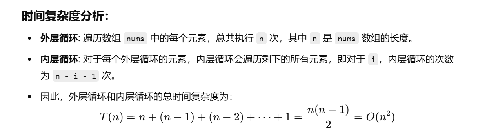
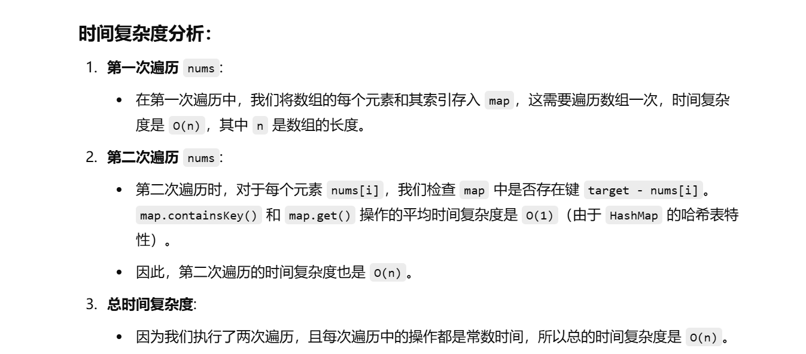
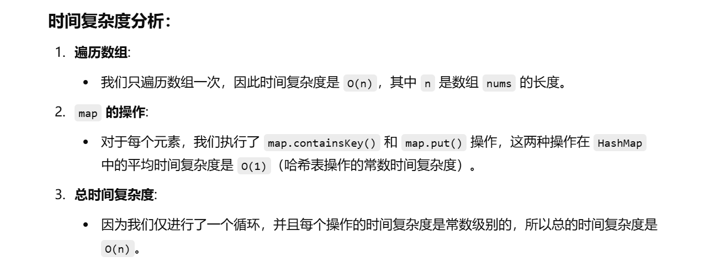

[1. 两数之和 - 力扣（LeetCode）](https://leetcode.cn/problems/two-sum/?envType=study-plan-v2&envId=top-100-liked)


这个题之前做过


知识点：哈希表


这次做目前想了个暴力和用哈希表的


# 暴力

```java
class Solution {
    public int[] twoSum(int[] nums, int target) {
        // 外层循环遍历数组中的每一个元素
        for (int i = 0; i < nums.length; i++) {
            // 内层循环遍历当前元素之后的所有元素
            for (int j = i + 1; j < nums.length; j++) {
                // 如果两个数的和等于目标值，则返回它们的索引
                if (nums[i] + nums[j] == target) {
                    return new int[]{i, j};  // 找到结果时直接返回索引
                } 
                // 如果两数和大于目标值，继续查找其他组合
                else if (nums[i] + nums[j] > target) {
                    continue;  // 如果和已经大于目标值，就跳过后面的判断
                }
            }
        }
        // 如果没有找到满足条件的两个数，返回一个空数组
        return new int[]{};
    }
}

```




# 自己想的哈希表

```java
class Solution {
    public int[] twoSum(int[] nums, int target) {

        // 创建一个 HashMap 来存储数组元素及其对应的索引
        HashMap<Integer, Integer> map = new HashMap<>();

        // 第一次遍历数组，将每个元素及其索引存入 map 中
        for (int i = 0; i < nums.length; i++) {
            // map.put(nums[i], i); 将每个元素 nums[i] 作为 key，元素的索引 i 作为 value 存入 HashMap
            map.put(nums[i], i);
        }

        // 第二次遍历数组，检查是否存在与当前元素和为 target 的另一个元素
        for (int i = 0; i < nums.length; i++) {
            // 检查是否存在一个元素，它和当前元素相加的和等于 target
            if (map.containsKey(target - nums[i])) {
                // 获取 target - nums[i] 对应的索引
                int j = map.get(target - nums[i]);
                // 如果 i 和 j 不相同，说明找到了两个不同的元素，它们的和为 target
                if (i != j) {
                    // 返回这两个元素的索引
                    return new int[]{i, map.get(target - nums[i])};
                }
            }
        }
        // 如果没有找到符合条件的两个数，返回一个空数组
        return new int[]{};
    }
}

```




# 哈希表优化

也就是在第一次for循环的时候就判断是否存在


```java
class Solution {
    public int[] twoSum(int[] nums, int target) {

        // 创建一个 HashMap 来存储数组元素及其对应的索引
        HashMap<Integer, Integer> map = new HashMap<>();

        // 遍历数组
        for (int i = 0; i < nums.length; i++) {
            // 检查 map 中是否已包含目标值减去当前元素的差值
            if (map.containsKey(target - nums[i])) {
                // 如果存在，说明找到了两个数之和等于 target，返回当前元素和目标元素的索引
                int j = map.get(target - nums[i]); // 获取之前存储的那个元素的索引
                return new int[]{i, map.get(target - nums[i])}; // 返回当前元素的索引和目标元素的索引
            }

            // 如果没有找到匹配的元素，则将当前元素和它的索引存入 map
            map.put(nums[i], i);
        }

        // 如果没有找到符合条件的两个数，返回一个空数组
        return new int[]{};
    }
}

```


