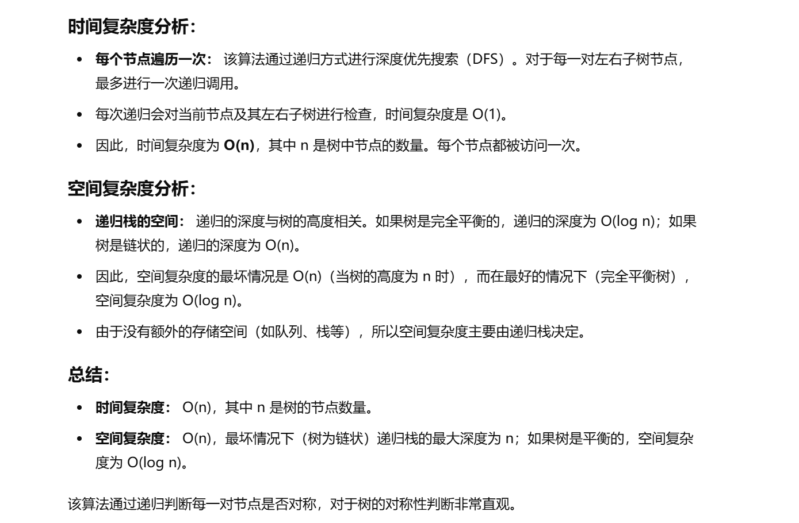

做过


[101. 对称二叉树 - 力扣（LeetCode）](https://leetcode.cn/problems/symmetric-tree/description/?envType=study-plan-v2&envId=top-100-liked)


没做出来


# 递归法

```java
class Solution {
    // 主方法，判断二叉树是否对称
    public boolean isSymmetric(TreeNode root) {
        // 调用 dfs 方法，传入根节点的左右子树进行判断
        return dfs(root.left, root.right);
    }

    // 深度优先搜索方法，递归判断左右子树是否对称
    public boolean dfs(TreeNode left, TreeNode right) {
        // 如果左子树为空而右子树不为空，则不对称
        if (left == null && right != null) {
            return false;
        }
        
        // 如果右子树为空而左子树不为空，则不对称
        if (left != null && right == null) {
            return false;
        }
        
        // 如果左右子树都为空，则对称
        if (left == null && right == null) {
            return true;
        }
        
        // 如果左右子树的节点值不同，则不对称
        if (left.val != right.val) {
            return false;
        }
        
        // 递归判断左子树的左节点与右子树的右节点对称，右子树的左节点与左子树的右节点对称
        boolean flag1 = dfs(left.left, right.right);
        boolean flag2 = dfs(left.right, right.left);
        
        // 左右子树都对称时，返回 true，否则返回 false
        return flag1 && flag2;
    }
}

```





# 迭代法（使用双端队列）


## 一个错误写法


```java
    class Solution {
        public boolean isSymmetric(TreeNode root) {
            Deque<TreeNode> queue = new ArrayDeque<>();
            queue.addFirst(root.left);
            queue.addLast(root.right);
            while (!queue.isEmpty()) {
                TreeNode left = queue.pollFirst();
                TreeNode right = queue.pollLast();
                if (left == null && right == null) {
                    continue;
                }
                if (left == null && right != null) {
                    return false;
                }
                if (left != null && right == null) {
                    return false;
                }
                if (left.val != right.val) {
                    return false;
                }
                queue.addFirst(left.right);
                queue.addLast(right.left);
                queue.addFirst(left.left);
                queue.addLast(right.right);
            }
            return true;
        }
    }
```


## 为什么错？

**因为ArrayDeque实现不支持添加null元素，以后要注意这一点**


**换成LinkedList就没错了**


## 正确写法


```java
class Solution {
    // 主方法，判断二叉树是否对称
    public boolean isSymmetric(TreeNode root) {
        // 使用双端队列（LinkedList 实现）来模拟层级遍历
        Deque<TreeNode> queue = new LinkedList<>();
        
        // 初始化队列，将根节点的左右子树加入队列
        queue.addFirst(root.left);
        queue.addLast(root.right);
        
        // 当队列不为空时，继续比较节点
        while (!queue.isEmpty()) {
            // 从队列中弹出左右两个节点进行比较
            TreeNode left = queue.pollFirst();   // 从队列头部弹出左子树节点
            TreeNode right = queue.pollLast();   // 从队列尾部弹出右子树节点
            
            // 如果左右节点都为 null，说明这对节点对称，继续处理下一对
            if (left == null && right == null) {
                continue;
            }
            
            // 如果左子树为 null 但右子树不为 null，或者右子树为 null 但左子树不为 null，说明不对称
            if (left == null || right == null) {
                return false;
            }
            
            // 如果左右节点的值不相同，则说明不对称
            if (left.val != right.val) {
                return false;
            }
            
            // 将下一层的左右节点加入队列，确保对称性检查
            queue.addFirst(left.right);  // 左子树的右子节点
            queue.addLast(right.left);   // 右子树的左子节点
            queue.addFirst(left.left);   // 左子树的左子节点
            queue.addLast(right.right);  // 右子树的右子节点
        }
        
        // 如果遍历完所有节点对，仍然没有发现不对称的情况，说明树是对称的
        return true;
    }
}

```


## 

