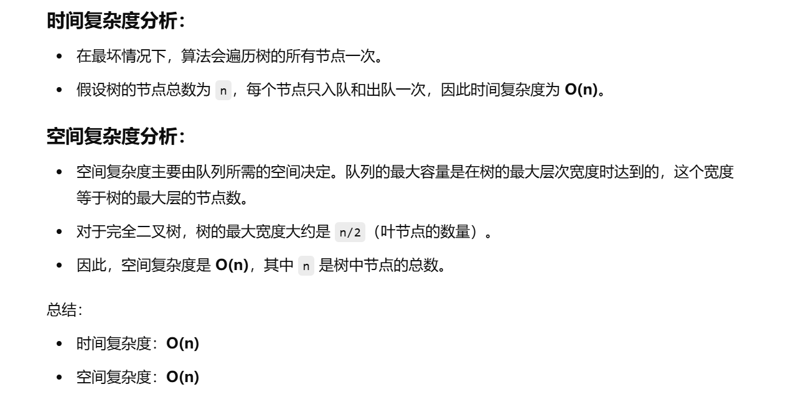

做过


[102. 二叉树的层序遍历 - 力扣（LeetCode）](https://leetcode.cn/problems/binary-tree-level-order-traversal/description/?envType=study-plan-v2&envId=top-100-liked)s


```java
class Solution {
    // 主函数，返回二叉树的层序遍历结果
    public List<List<Integer>> levelOrder(TreeNode root) {
        List<List<Integer>> ans = new ArrayList<>();  // 存储最终的结果，每个子列表是每一层的节点值
        if (root == null) {  // 如果根节点为空，直接返回空的列表
            return ans;
        }

        // 使用队列实现广度优先搜索 (BFS)
        Deque<TreeNode> queue = new LinkedList<>();  // 队列用于存储节点，保证按层次访问
        queue.offer(root);  // 将根节点入队

        while (!queue.isEmpty()) {  // 当队列不为空时，继续遍历树的各个层
            int size = queue.size();  // 当前层节点的数量
            List<Integer> temp = new ArrayList<>();  // 临时存储当前层的节点值

            // 遍历当前层的所有节点
            for (int i = 0; i < size; i++) {
                TreeNode node = queue.poll();  // 从队列中取出一个节点
                temp.add(node.val);  // 将节点的值加入当前层的列表

                // 如果当前节点有左子节点，将左子节点加入队列
                if (node.left != null) {
                    queue.offer(node.left);
                }
                // 如果当前节点有右子节点，将右子节点加入队列
                if (node.right != null) {
                    queue.offer(node.right);
                }
            }

            // 将当前层的节点值列表添加到最终结果中
            ans.add(temp);
        }

        // 返回二叉树的层序遍历结果
        return ans;
    }
}

```


