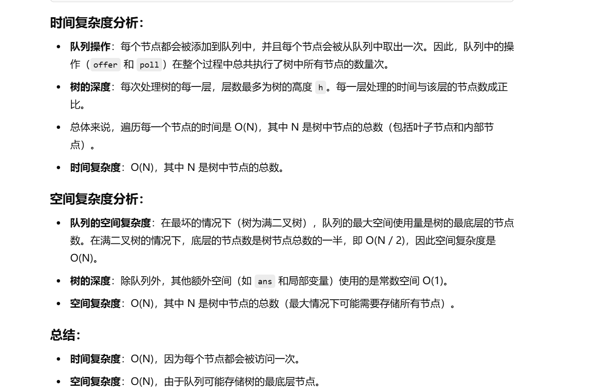
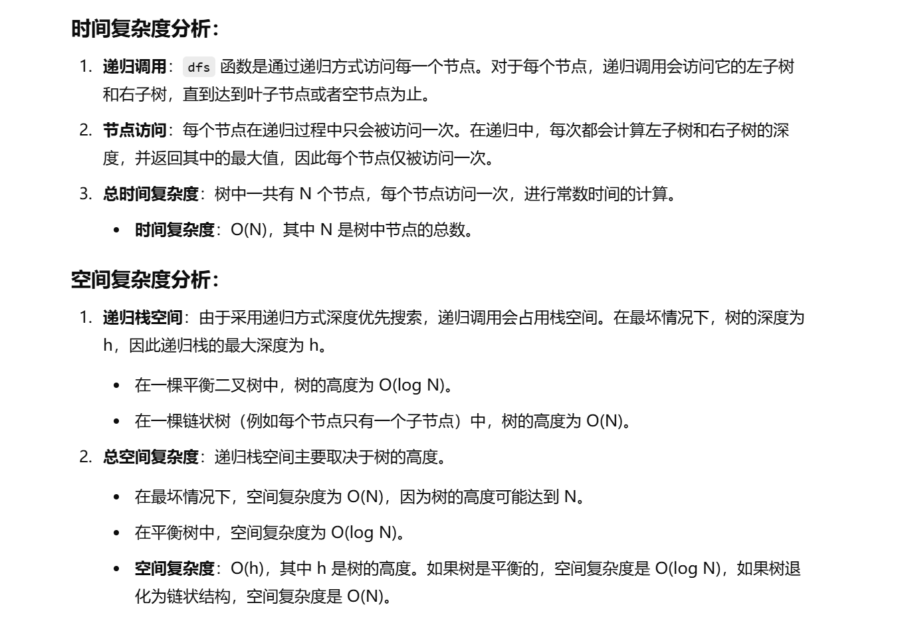
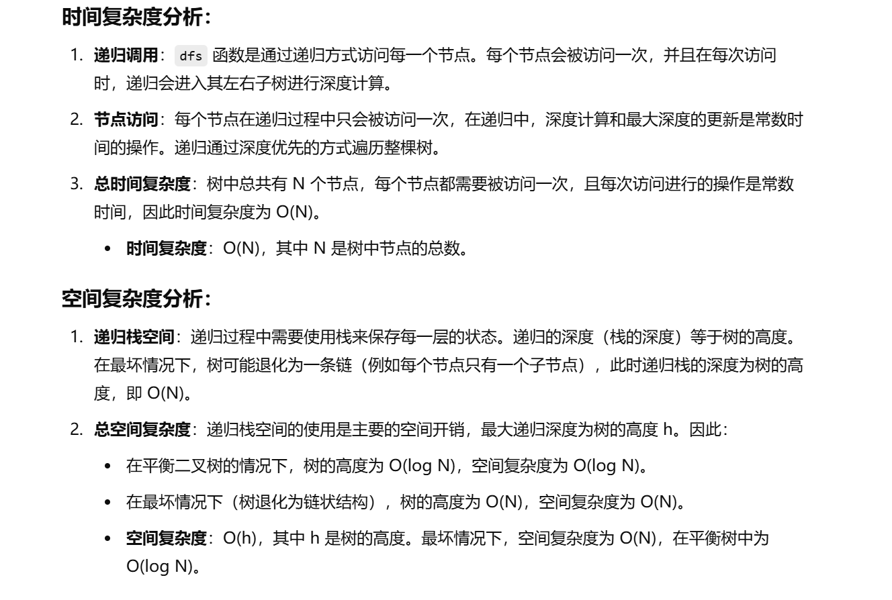

做过


[104. 二叉树的最大深度 - 力扣（LeetCode）](https://leetcode.cn/problems/maximum-depth-of-binary-tree/description/?envType=study-plan-v2&envId=top-100-liked)


# BFS做法


```java
class Solution {
    // 使用广度优先搜索（BFS）计算二叉树的最大深度
    public int maxDepth(TreeNode root) {
        // 如果树为空，深度为0
        if (root == null) {
            return 0;
        }
        
        // 创建一个队列用于存储树的节点
        Deque<TreeNode> queue = new ArrayDeque<>();
        queue.offer(root);  // 将根节点放入队列
        int ans = 0;  // 记录树的深度

        // 当队列不为空时，执行以下操作
        while (!queue.isEmpty()) {
            // 当前层的节点数
            int size = queue.size();
            // 遍历当前层的所有节点
            for (int i = 0; i < size; i++) {
                TreeNode cur = queue.poll();  // 从队列中取出一个节点
                // 如果当前节点的左子树不为空，将左子节点加入队列
                if (cur.left != null) {
                    queue.offer(cur.left);
                }
                // 如果当前节点的右子树不为空，将右子节点加入队列
                if (cur.right != null) {
                    queue.offer(cur.right);
                }
            }
            // 每次处理完一层，深度增加1
            ans++;
        }
        
        // 返回计算出的树的最大深度
        return ans;
    }
}

```





# DFS方法（自底向上）


```java
class Solution {
    // 入口函数，调用 dfs 函数计算最大深度
    public int maxDepth(TreeNode root) {
        return dfs(root);  // 从根节点开始计算最大深度
    }

    // 深度优先搜索（DFS）算法，用于计算树的最大深度
    public int dfs(TreeNode root) {
        // 如果当前节点为空，返回深度0
        if (root == null) {
            return 0;
        }
        
        // 递归计算左子树的深度
        int left = dfs(root.left) + 1;  // 左子树的深度加上当前节点
        // 递归计算右子树的深度
        int right = dfs(root.right) + 1;  // 右子树的深度加上当前节点
        
        // 返回左子树和右子树中较大的深度
        return Math.max(left, right);  // 返回最大深度
    }
}

```





# DFS方法（自顶向下）


```java
class Solution {
    // 记录当前树的最大深度
    int ans;

    // 入口函数，调用 dfs 函数来计算最大深度
    public int maxDepth(TreeNode root) {
        // 初始化答案，深度从0开始
        dfs(root, 0);  // 从根节点开始计算深度
        return ans;  // 返回最大深度
    }

    // 深度优先搜索（DFS）递归函数，计算树的最大深度
    public void dfs(TreeNode root, int depth) {
        // 如果当前节点为空，直接返回
        if (root == null) {
            return;
        }

        // 递归计算当前节点的深度
        depth++;  // 当前节点的深度是其父节点深度加1
        // 更新当前的最大深度
        ans = Math.max(ans, depth);  // 更新最大深度

        // 递归遍历左子树
        dfs(root.left, depth);
        // 递归遍历右子树
        dfs(root.right, depth);
    }
}

```


