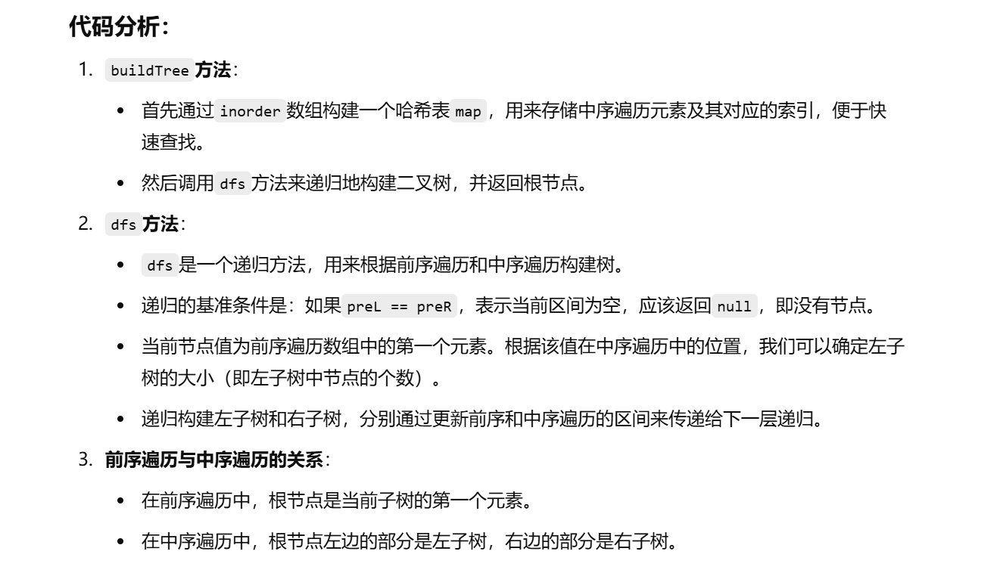
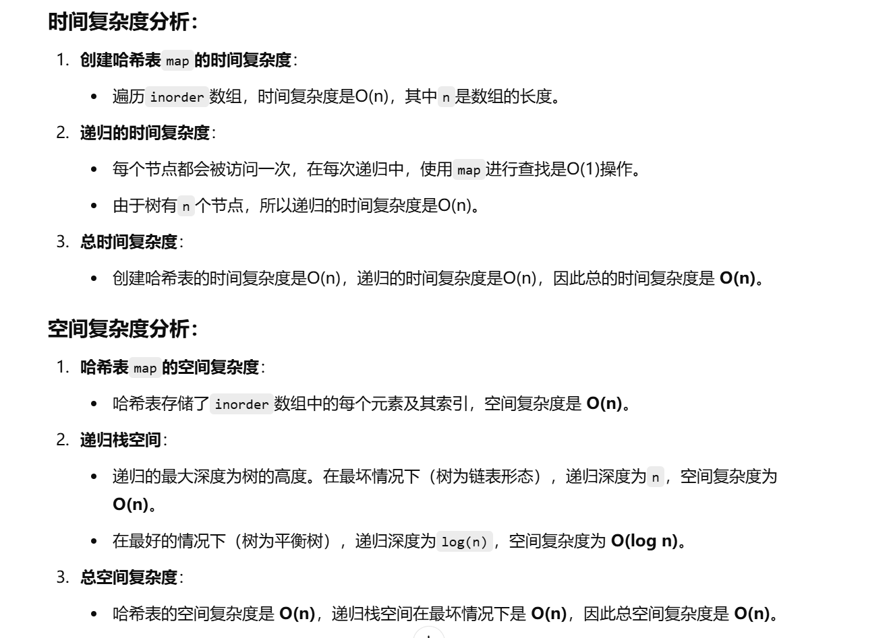

做过


[105. 从前序与中序遍历序列构造二叉树 - 力扣（LeetCode）](https://leetcode.cn/problems/construct-binary-tree-from-preorder-and-inorder-traversal/description/?envType=study-plan-v2&envId=top-100-liked)


想起来哈希表找索引了，但是具体怎么dfs还是忘了

做到了下面这一步


```java
    class Solution {
        public TreeNode buildTree(int[] preorder, int[] inorder) {
            Map<Integer, Integer> map = new HashMap<>();
            for (int i = 0; i < inorder.length; i++) {
                map.put(inorder[i], i);
            }
            TreeNode root = new TreeNode(preorder[0]);
        }

        public TreeNode dfs(TreeNode root, Map<Integer, Integer> map, int[] preorder, int[] inorder) {
            
        }
    }

```


左神：[算法讲解036【必备】二叉树高频题目-上-不含树型dp_哔哩哔哩_bilibili](https://www.bilibili.com/video/BV1Rp4y1g7ys/?spm_id_from=333.1387.search.video_card.click&vd_source=96c1635797a0d7626fb60e973a29da38)


```java
class Solution {
    // buildTree方法，用于根据前序遍历和中序遍历数组重建二叉树
    public TreeNode buildTree(int[] preorder, int[] inorder) {
        // 创建一个哈希表，用于快速查找中序遍历中某个值的索引
        Map<Integer, Integer> map = new HashMap<>();
        // 填充map，将中序遍历中的值和它们对应的索引存入map
        for (int i = 0; i < inorder.length; i++) {
            map.put(inorder[i], i);
        }
        int n = preorder.length;  // 获取前序遍历的长度
        // 通过递归调用dfs来构建树
        // 传入前序遍历数组的起始和结束索引、中序遍历数组的起始和结束索引以及map
        //区间：左闭右开
        TreeNode root = dfs(preorder, 0, n, inorder, 0, n, map);
        return root;  // 返回构建的树的根节点
    }

    // dfs方法用于递归构建树的节点
    public TreeNode dfs(int[] preorder, int preL, int preR, int[] inorder, int inL, int inR, Map<Integer, Integer> map) {
        // 如果当前区间为空（前序遍历区间或者中序遍历区间没有节点），则返回null
        if (preL == preR) {
            return null;
        }
        // 创建当前节点，当前节点值为前序遍历中的第一个元素
        TreeNode root = new TreeNode(preorder[preL]);
        // 在map中查找当前节点值在中序遍历中的位置
        int m = map.get(preorder[preL]);
        // 左子树的大小为中序遍历中当前节点位置与左边界的差值
        int leftSize = m - inL;  // 左子树的节点个数
        // 递归构建左子树
        root.left = dfs(preorder, preL + 1, preL + 1 + leftSize, inorder, inL, m - 1, map);
        // 递归构建右子树
        root.right = dfs(preorder, preL + 1 + leftSize, preR, inorder, m + 1, inR, map);
        // 返回当前节点
        return root;
    }
}

```





