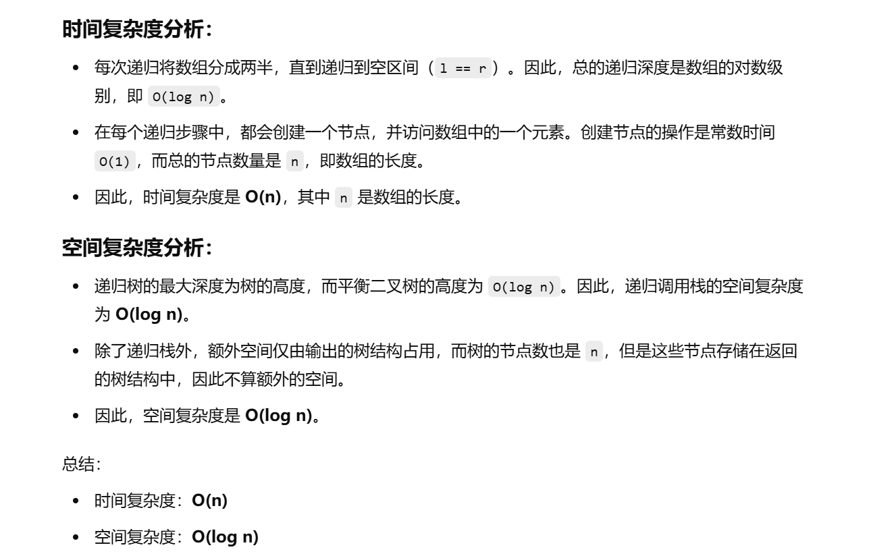

做过


[108. 将有序数组转换为二叉搜索树 - 力扣（LeetCode）](https://leetcode.cn/problems/convert-sorted-array-to-binary-search-tree/description/?envType=study-plan-v2&envId=top-100-liked)


没做出来


```java
class Solution {
    // 主函数，将有序数组转换为平衡二叉搜索树 (BST)
    public TreeNode sortedArrayToBST(int[] nums) {
        return dfs(0, nums.length, nums);  // 调用递归函数，传入数组的起始和结束位置
    }

    // 递归函数：构建平衡二叉搜索树
    public TreeNode dfs(int l, int r, int[] nums) {
        if (l == r) {  // 如果区间为空，返回 null（叶子节点的子节点）
            return null;
        }

        // 计算当前区间的中间索引
        int m = (r - l) / 2 + l;
        // 创建当前中间节点
        TreeNode node = new TreeNode(nums[m]);

        // 递归构建左子树，区间为 [l, m)
        node.left = dfs(l, m, nums);

        // 递归构建右子树，区间为 [m + 1, r)
        node.right = dfs(m + 1, r, nums);

        return node;  // 返回构建的节点
    }
}

```


