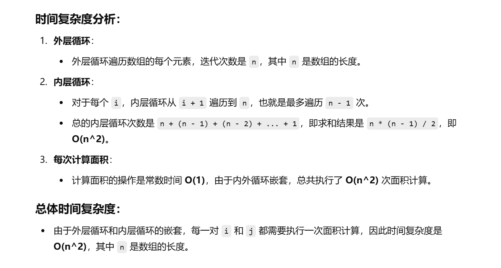
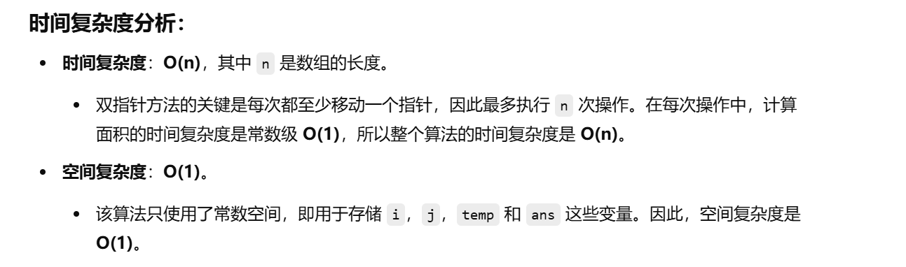

没做过这道题目


知识点：双指针


[11. 盛最多水的容器 - 力扣（LeetCode）](https://leetcode.cn/problems/container-with-most-water/?envType=study-plan-v2&envId=top-100-liked)


# 自己想的暴力算法，超时了


```java
class Solution {
    // maxArea 方法，用于计算给定高度数组中两条线所围成的最大容器面积
    public int maxArea(int[] height) {
        // 记录最大的面积
        int ans = 0;

        // 双重循环遍历每一对线段
        for (int i = 0; i < height.length; i++) {
            for (int j = i + 1; j < height.length; j++) {
                // 计算由高度为 height[i] 和 height[j] 的两条线段，以及它们之间的宽度 (j - i) 所围成的面积
                int temp = (j - i) * Math.min(height[i], height[j]);
                // 更新最大面积
                ans = Math.max(ans, temp);
            }
        }

        // 返回最大面积
        return ans;
    }
}

```





# 我的第二种做法，也是正确做法


自己想到了一种做法，就是双指针一个指向最左边，一个指向最右边，然后哪边指向的高度低，哪边的指针向中间移动，每移动一次都与记录的最大面积进行比较


```java
class Solution {
    public int maxArea(int[] height) {
        // 初始化两个指针，i指向数组的开始，j指向数组的结束
        int i = 0, j = height.length - 1;
        
        // 初始化最大面积 ans，使用 i 和 j 对应位置的高度来计算
        // 容器的宽度为 (j - i)，高度为 min(height[i], height[j])
        int ans = (j - i) * Math.min(height[i], height[j]);
        
        // 使用双指针法，当 i < j 时不断更新最大面积
        while (i < j) {
            // 根据当前左右两边的高度决定移动哪个指针
            if (height[i] <= height[j]) {
                // 如果左边的高度较小，移动左指针 i++
                i++;
            } else {
                // 如果右边的高度较小，移动右指针 j--
                j--;
            }
            
            // 计算新的面积
            // 新的宽度是 j - i，新高度是 min(height[i], height[j])
            int temp = (j - i) * Math.min(height[i], height[j]);
            
            // 更新最大面积
            ans = Math.max(ans, temp);
        }
        
        // 返回最终的最大面积
        return ans;
    }
}

```

