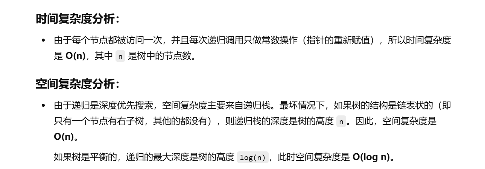
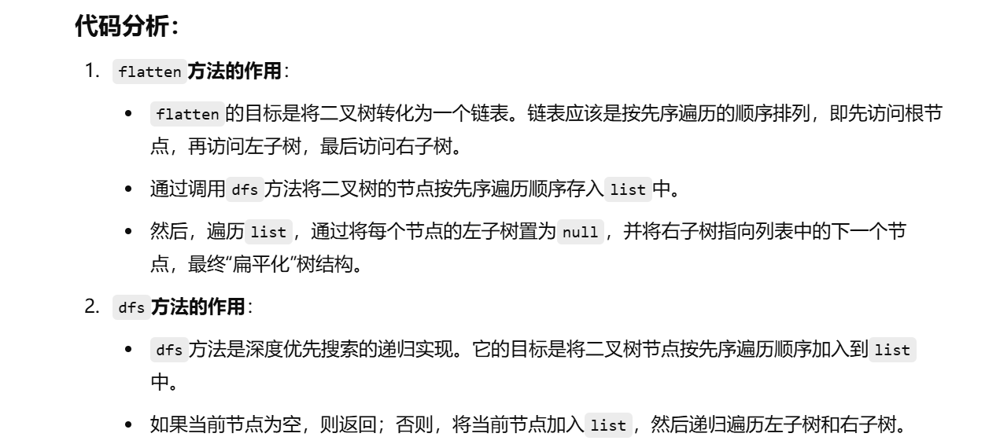
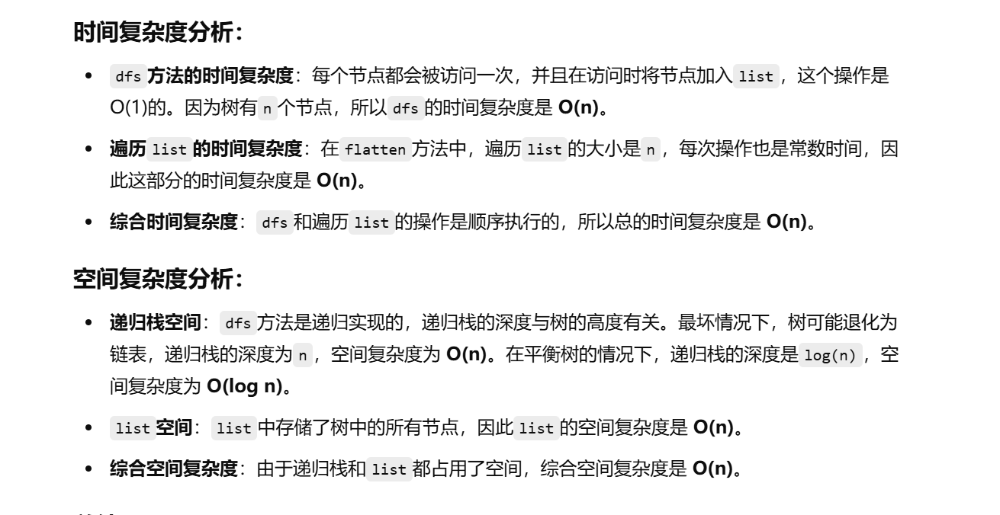

没做过


[114. 二叉树展开为链表 - 力扣（LeetCode）](https://leetcode.cn/problems/flatten-binary-tree-to-linked-list/description/?envType=study-plan-v2&envId=top-100-liked)


不会


# 解法1

灵神做法：头插法


[114. 二叉树展开为链表 - 力扣（LeetCode）](https://leetcode.cn/problems/flatten-binary-tree-to-linked-list/solutions/2992172/liang-chong-fang-fa-tou-cha-fa-fen-zhi-p-h9bg/?envType=study-plan-v2&envId=top-100-liked)


```java
class Solution {
    // 用于存储链表头节点
    TreeNode head;

    // 主函数，调用dfs方法来“扁平化”二叉树
    public void flatten(TreeNode root) {
        dfs(root);  // 从根节点开始进行深度优先搜索
    }

    // dfs方法，用于递归地“扁平化”树
    public void dfs(TreeNode root) {
        if (root == null) {  // 如果当前节点为空，直接返回
            return;
        }
        
        // 递归先遍历右子树
        dfs(root.right);
        
        // 然后遍历左子树
        dfs(root.left);
        
        // 在处理当前节点时，先把当前节点的左子树设为空
        root.left = null;
        
        // 当前节点的右子树指向已经处理过的链表头节点head
        root.right = head;
        
        // 更新链表头节点为当前节点
        head = root;
    }
}

```





# 解法2


官方的一种先收集节点后处理的解法

[114. 二叉树展开为链表 - 力扣（LeetCode）](https://leetcode.cn/problems/flatten-binary-tree-to-linked-list/solutions/356853/er-cha-shu-zhan-kai-wei-lian-biao-by-leetcode-solu/?envType=study-plan-v2&envId=top-100-liked)


```java
class Solution {
    // 主函数，调用dfs方法来“扁平化”二叉树
    public void flatten(TreeNode root) {
        List<TreeNode> list = new ArrayList<>();  // 创建一个列表来保存树的节点
        dfs(root, list);  // 深度优先搜索，将树的节点按先序遍历顺序加入列表
        
        // 遍历保存节点的列表，并将每个节点的右子树连接到下一个节点
        for (int i = 1; i < list.size(); i++) {
            TreeNode pre = list.get(i - 1);  // 获取前一个节点
            TreeNode cur = list.get(i);      // 获取当前节点
            pre.left = null;  // 将前一个节点的左子树设为空
            pre.right = cur;  // 将前一个节点的右子树指向当前节点
        }
    }

    // dfs方法，递归遍历树并将节点按先序遍历顺序加入列表
    public void dfs(TreeNode root, List<TreeNode> list) {
        if (root == null) {  // 如果当前节点为空，直接返回
            return;
        }
        list.add(root);  // 将当前节点加入列表
        dfs(root.left, list);  // 递归遍历左子树
        dfs(root.right, list); // 递归遍历右子树
    }
}

```





