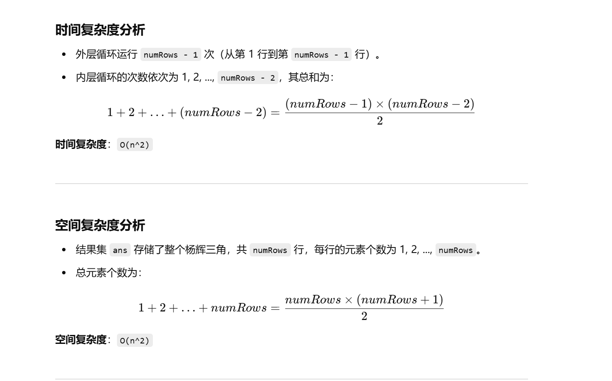

没做过


[118. 杨辉三角 - 力扣（LeetCode）](https://leetcode.cn/problems/pascals-triangle/description/?envType=study-plan-v2&envId=top-100-liked)


灵神做法：[118. 杨辉三角 - 力扣（LeetCode）](https://leetcode.cn/problems/pascals-triangle/?envType=study-plan-v2&envId=top-100-liked)


```java
import java.util.ArrayList;
import java.util.List;

class Solution {
    /**
     * 生成杨辉三角（Pascal's Triangle）
     *
     * @param numRows 需要生成的行数
     * @return 由 List 组成的杨辉三角
     */
    public List<List<Integer>> generate(int numRows) {
        // 创建一个存储最终结果的列表
        List<List<Integer>> ans = new ArrayList<>();
        
        // 初始化第一行的元素为 [1]
        List<Integer> temp = new ArrayList<>();
        temp.add(1);
        ans.add(temp);

        // 从第二行开始生成每一行
        for (int i = 1; i < numRows; i++) {
            // 创建当前行的列表
            List<Integer> path = new ArrayList<>();
            
            // 每一行的第一个元素始终为 1
            path.add(1);

            // 填充当前行的中间部分元素
            // 当前行第 j 个元素 = 上一行第 j 个元素 + 上一行第 j-1 个元素
            for (int j = 1; j < i; j++) {
                path.add(ans.get(i - 1).get(j) + ans.get(i - 1).get(j - 1));
            }

            // 每一行的最后一个元素始终为 1
            path.add(1);

            // 将当前行加入结果集中
            ans.add(path);
        }

        // 返回最终的杨辉三角
        return ans;
    }
}

```


