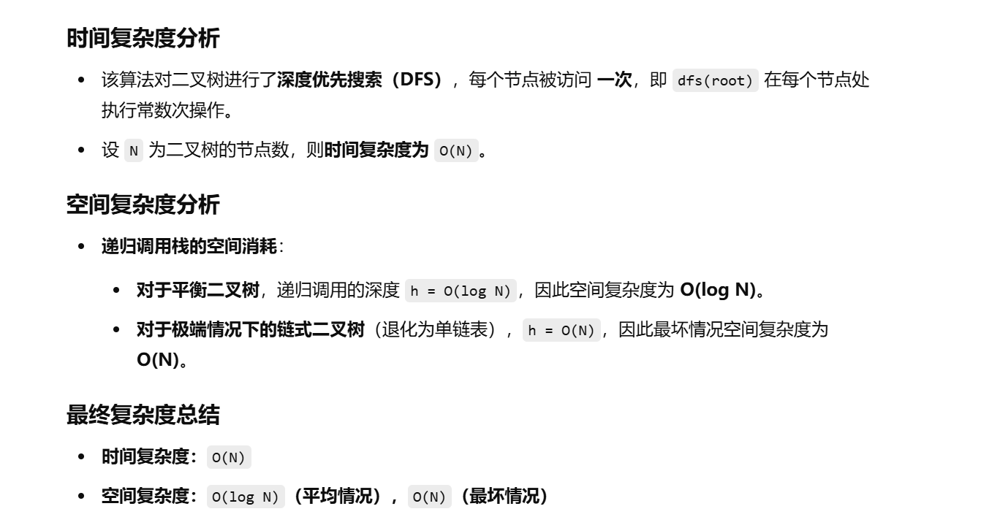

[树形 DP：树的直径【基础算法精讲 23】_哔哩哔哩_bilibili](https://www.bilibili.com/video/BV17o4y187h1/?vd_source=96c1635797a0d7626fb60e973a29da38)


没做过


[124. 二叉树中的最大路径和 - 力扣（LeetCode）](https://leetcode.cn/problems/binary-tree-maximum-path-sum/description/?envType=study-plan-v2&envId=top-100-liked)


自己的一个想法，从下往上归，然后分别求当前节点的左子树和右子树的最大路径，然后与当前节点值三者相加


# 我写的错误代码，实现的是左子树和右子树的最大值和当前节点值两者相加

```
    class Solution {
        int ans = Integer.MIN_VALUE;

        public int maxPathSum(TreeNode root) {
            dfs(root);
            return ans;
        }

        public int dfs(TreeNode root) {
            if (root == null) {
                return 0;
            }
            int left = dfs(root.left);
            int right = dfs(root.right);
            int temp = Math.max(left, right) + root.val;
            ans = Math.max(ans, temp);
            return temp;
        }
    }
```


# 后面自己代码的改进。把逻辑写对了

```java
class Solution {
    // 记录全局的最大路径和，初始化为最小整数值
    int ans = Integer.MIN_VALUE;

    // 主函数，调用深度优先搜索（DFS）方法计算最大路径和
    public int maxPathSum(TreeNode root) {
        dfs(root); // 递归计算最大路径和
        return ans; // 返回最终的最大路径和
    }

    // 递归函数：计算从当前节点出发的最大路径和
    public int dfs(TreeNode root) {
        // 如果当前节点为空，返回 0（不贡献路径和）
        if (root == null) {
            return 0;
        }

        // 递归计算左子树的最大路径和
        int left = dfs(root.left);
        // 递归计算右子树的最大路径和
        int right = dfs(root.right);

        // 计算左、右子树中较大的路径值
        int max = Math.max(left, right);

        // 如果左右子树的最大路径和都是负数，则当前节点单独成为最大路径
        if (max < 0) {
            ans = Math.max(ans, root.val);
        } else {
            // 如果最大路径和来自左子树
            if (max == left) {
                // 右子树的路径值为正时，考虑左右子树加当前节点
                if (right > 0) {
                    ans = Math.max(ans, max + right + root.val);
                } 
                // 右子树的路径值为负或 0，则仅考虑最大子树路径和加当前节点
                else {
                    ans = Math.max(ans, max + root.val);
                }
            } 
            // 如果最大路径和来自右子树
            else {
                // 左子树的路径值为正时，考虑左右子树加当前节点
                if (left > 0) {
                    ans = Math.max(ans, max + left + root.val);
                } 
                // 左子树的路径值为负或 0，则仅考虑最大子树路径和加当前节点
                else {
                    ans = Math.max(ans, max + root.val);
                }
            }
        }

        // 计算当前节点可以贡献给上层递归的最大路径和
        int temp = max <= 0 ? root.val : max + root.val;
        return temp; // 只返回当前节点及其单侧子树的最大路径和
    }
}

```





# 简洁写法


```java
    class Solution {
        int ans = Integer.MIN_VALUE;

        public int maxPathSum(TreeNode root) {
            dfs(root);
            return ans;
        }

        public int dfs(TreeNode root) {
            if (root == null) {
                return 0;
            }
            int left = dfs(root.left);
            int right = dfs(root.right);
            ans = Math.max(ans, left + right + root.val);
            int temp = Math.max(0, Math.max(left, right) + root.val);
            return temp;
        }
    }
```

