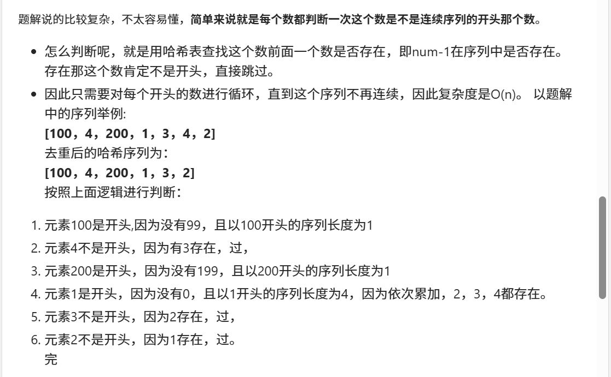

这个题目之前没做过


[128. 最长连续序列 - 力扣（LeetCode）](https://leetcode.cn/problems/longest-consecutive-sequence/?envType=study-plan-v2&envId=top-100-liked)


知识点：哈希表


没做出来，不过我想到哈希表常数时间了，没想出具体做法


# 不符合题目时间复杂度的做法（用排序）

```java
class Solution {
    // 该方法用于找到给定未排序整数数组 nums 中最长连续子序列的长度
    public int longestConsecutive(int[] nums) {
        
        // 如果数组为空，直接返回 0
        if (nums.length == 0) {
            return 0;
        }

        // 对数组进行排序，排序后可以直接检查数字的连续性
        Arrays.sort(nums);

        // 初始化最大连续子序列长度为 1，因为至少有一个元素
        int ans = 1;
        // temp 用来记录当前连续子序列的长度
        int temp = 1;

        // 遍历排序后的数组，查找最长的连续子序列
        for (int i = 1; i < nums.length; i++) {

            // 如果当前元素是前一个元素加 1，说明是一个连续的子序列的一部分
            if (nums[i] == nums[i - 1] + 1) {
                temp++;  // 连续子序列长度增加
                // 更新最长子序列长度
                ans = Math.max(ans, temp);
            } 
            // 如果当前元素等于前一个元素，说明是重复元素，跳过
            else if (nums[i] == nums[i - 1]) {
                continue;
            } 
            // 如果当前元素不是前一个元素加 1，说明当前子序列已经结束
            else {
                temp = 1;  // 重新开始计算新的子序列长度
            }
        }

        // 返回最长连续子序列的长度
        return ans;
    }
}

```


# 正确做法


```java
class Solution {
    // 主函数：寻找数组 nums 中的最长连续序列
    public int longestConsecutive(int[] nums) {
        // 如果数组为空，直接返回0，因为没有元素，不能构成连续序列
        if (nums.length == 0) {
            return 0;
        }
        
        // 创建一个哈希集合，用于存储数组中的所有元素，自动去重
        HashSet<Integer> set = new HashSet<>();
        
        // 将数组中的每个元素添加到哈希集合中，去重
        for (int num : nums) {
            set.add(num);  //将数组放入set中，并顺便完成了去重
        }
        
        // 记录当前找到的最长连续序列的长度
        int ans = 0;
        
        // 遍历集合中的每个元素，尝试找到以该元素为起点的最长连续序列
        for (int num : set) {
            // 从当前元素开始，计数连续序列的长度
            int count = 1;
            int curNum = num;
            
            // 如果当前数字的前一个数字已经在集合中，说明当前这个数不是连续序列的开头，跳过
            // 这样可以避免重复计算
            if (set.contains(curNum - 1)) {
                continue;
            }
            
            // 继续向后查找连续数字，直到找不到为止
            while (set.contains(curNum + 1)) {
                curNum++;  // 移动到下一个连续数字
                count++;    // 连续序列长度增加
            }
            
            // 更新最长连续序列长度
            ans = Math.max(count, ans);
        }
        
        // 返回最终的最长连续序列长度
        return ans;
    }
}

```


## 代码举例说明




### 时间复杂度分析

1. **构建哈希集合**：
   创建一个 `HashSet` 来存储数组中的元素，插入操作的时间复杂度是 O(1)，所以遍历数组并将每个元素插入集合的时间复杂度是 O(n)，其中 n 是数组的大小。
2. **遍历哈希集合**：
   接下来，遍历 `set` 中的每个元素。每次遍历到一个元素时，都会检查它是否已经是一个连续序列的起始点。检查一个元素是否是序列的起点的时间复杂度是 O(1)，而查找它的连续数字的过程中，实际上每个数字最多会被检查一次，因此所有数字的查找过程的总时间复杂度是 O(n)。
3. **总体复杂度**：
   由于每个元素最多只会被检查两次（一次在判断是否是起点时，一次在向后查找连续数字时），所以总的时间复杂度为 O(n)。
4. **空间复杂度**：
   使用了一个哈希集合来存储所有的数字，因此空间复杂度是 O(n)，其中 n 是数组的长度。