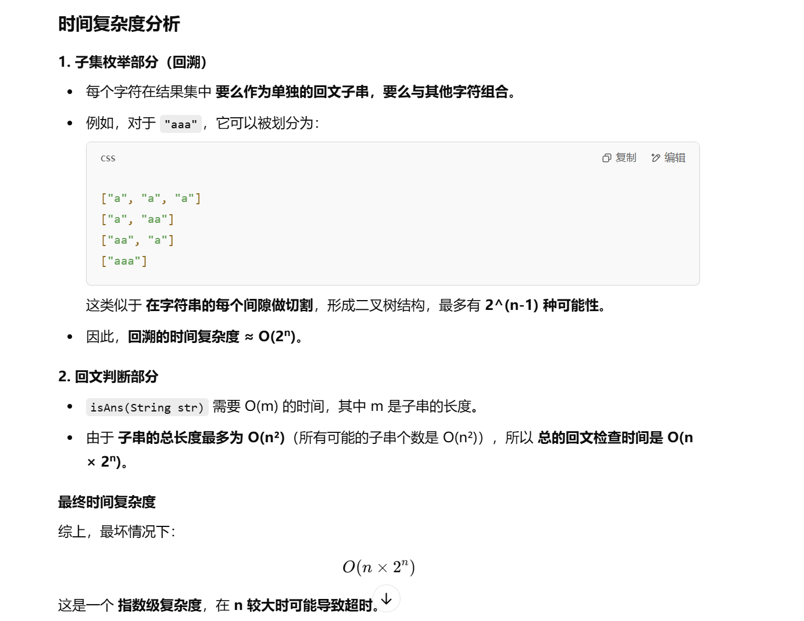

做过


[131. 分割回文串 - 力扣（LeetCode）](https://leetcode.cn/problems/palindrome-partitioning/description/?envType=study-plan-v2&envId=top-100-liked)


不会


```java
import java.util.ArrayList;
import java.util.List;

class Solution {
    List<List<String>> ans; // 存储所有满足条件的回文划分结果
    List<String> temp; // 临时存储当前回文子串的组合
    String str; // 记录输入字符串

    public List<List<String>> partition(String s) {
        ans = new ArrayList<>(); // 初始化结果列表
        temp = new ArrayList<>(); // 初始化临时列表
        str = s; // 记录输入字符串
        dfs(0); // 从索引 0 开始回溯搜索
        return ans; // 返回最终的回文划分结果
    }

    public void dfs(int index) {
        // 递归终止条件：当索引达到字符串末尾时，说明找到了一种有效的划分
        if (index == str.length()) {
            ans.add(new ArrayList<>(temp)); // 将当前的划分添加到结果集中
            return;
        }

        // 遍历从 index 开始的所有可能的子串
        for (int j = index; j < str.length(); j++) {
            String leftStr = str.substring(index, j + 1); // 提取子串 [index, j]
            if (isAns(leftStr)) { // 检查子串是否是回文
                temp.add(leftStr); // 选择当前子串
                dfs(j + 1); // 递归处理剩余部分
                temp.remove(temp.size() - 1); // 回溯，撤销选择
            }
        }
    }

    public boolean isAns(String str) {
        int left = 0;
        int right = str.length() - 1;
        while (left <= right) { // 双指针检查回文性
            if (str.charAt(left) == str.charAt(right)) {
                left++; // 左指针右移
                right--; // 右指针左移
            } else {
                return false; // 只要有一对字符不相等，就不是回文
            }
        }
        return true; // 如果遍历完成，说明是回文
    }
}

```



