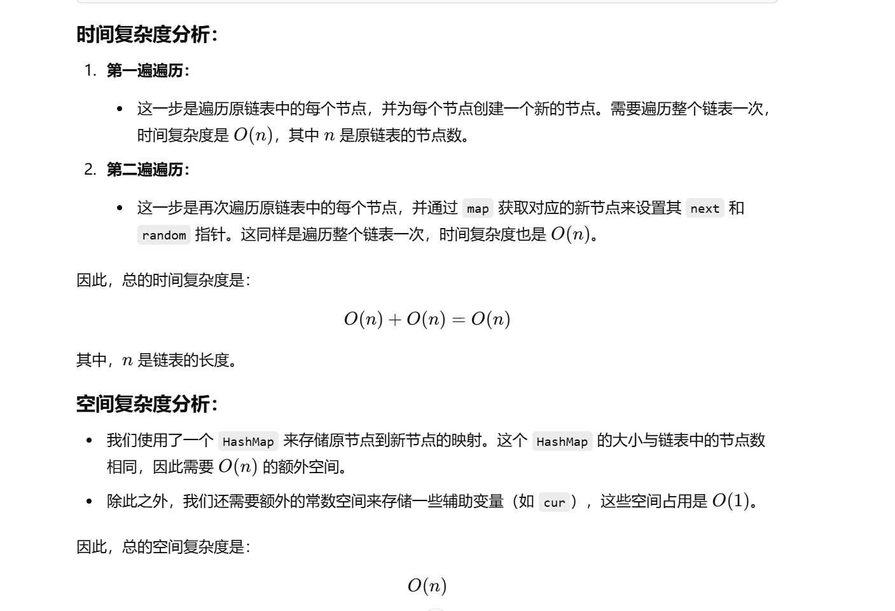
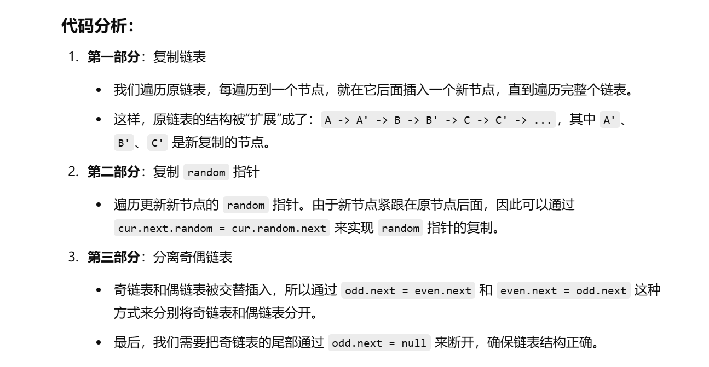
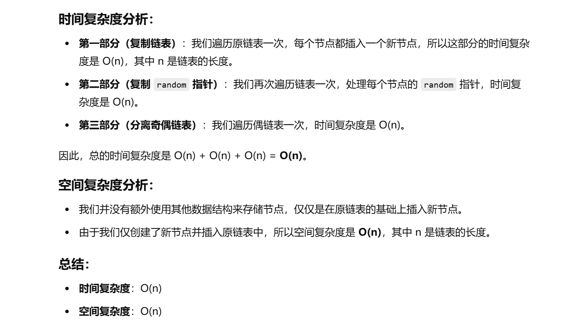

[算法讲解034【必备】链表高频题目和必备技巧_哔哩哔哩_bilibili](https://www.bilibili.com/video/BV1A14y1i7GY/?spm_id_from=333.1387.upload.video_card.click&vd_source=96c1635797a0d7626fb60e973a29da38)


做过


[138. 随机链表的复制 - 力扣（LeetCode）](https://leetcode.cn/problems/copy-list-with-random-pointer/description/?envType=study-plan-v2&envId=top-100-liked)


没做出来


# 用哈希表

```java
class Solution {
    // 定义一个方法来复制一个带有随机指针的链表
    public Node copyRandomList(Node head) {
        // 创建一个HashMap来存储原链表中的节点与新链表节点的映射
        Map<Node, Node> map = new HashMap<>();
        
        // cur指针用于遍历原链表
        Node cur = head;
        
        // 第一步：创建新节点，并存入map中
        // 遍历原链表，为每个节点创建一个新的节点，并将原节点与新节点的映射关系存入map中
        while (cur != null) {
            // 在map中存储原节点与新节点的映射，值为新创建的节点
            map.put(cur, new Node(cur.val));
            // 移动cur指针到下一个节点
            cur = cur.next;
        }
        
        // 重新设置cur指针为头节点，用来再次遍历原链表
        cur = head;
        
        // 第二步：设置新节点的next和random指针
        // 遍历原链表，为每个新节点设置正确的next指针和random指针
        while (cur != null) {
            // 设置新节点的next指针，映射到原节点的next节点
            map.get(cur).next = map.get(cur.next);
            // 设置新节点的random指针，映射到原节点的random节点
            map.get(cur).random = map.get(cur.random);
            // 移动cur指针到下一个节点
            cur = cur.next;
        }
        
        // 返回新链表的头节点，即原链表头节点对应的新节点
        return map.get(head);
    }
}

```





# 第二种不用哈希表的方法


最后的奇偶链表分离和[328. 奇偶链表 - 力扣（LeetCode）](https://leetcode.cn/problems/odd-even-linked-list/description/)一样

```java
class Solution {
    public Node copyRandomList(Node head) {
        // 如果原链表为空，直接返回 null
        if (head == null) {
            return null;
        }

        Node cur = head;
        
        // 第一部分：复制链表（新节点插入到原链表中）
        // 遍历原链表，为每个原节点插入一个新节点
        while (cur != null) {
            // 创建一个新节点，值和当前节点相同
            Node temp = new Node(cur.val);
            // 新节点的 next 指向当前节点的 next
            temp.next = cur.next;
            // 当前节点的 next 指向新节点
            cur.next = temp;
            // cur 移动到下一个原节点
            cur = cur.next.next;  // 直接跳过新节点，继续处理原链表的下一个节点
        }

        // 第二部分：复制 random 指针
        // 再次遍历原链表，处理 new 节点的 random 指针
        cur = head;
        while (cur != null) {
            // 如果当前节点的 random 指针不为空
            if (cur.random != null) {
                // 当前节点的 next 节点（即新节点）的 random 指针指向原节点 random 指向的下一个节点（即新节点）
                cur.next.random = cur.random.next;
            }
            // 移动到下一个原节点
            cur = cur.next.next;  // 跳过新节点，继续处理原链表
        }

        // 第三部分：分离奇偶链表
        Node odd = head;  // 奇链表的头节点是原链表的第一个节点
        Node even = head.next;  // 偶链表的头节点是原链表的第二个节点
        Node newHead = even;  // 偶链表的头节点保存下来

        // 遍历偶链表，并将原链表中的奇节点和偶节点分开
        while (even.next != null) {
            // 奇链表的下一个节点是偶链表的下一个节点
            odd.next = even.next;
            // 奇链表指针移动到下一个奇节点
            odd = odd.next;
            // 偶链表的下一个节点是奇链表的下一个节点
            even.next = odd.next;
            // 偶链表指针移动到下一个偶节点
            even = even.next;
        }

        // 最后，奇链表的尾节点应该指向 null
        odd.next = null;  
        // 这个地方画个图就理解了，比如 1-1'-2-2'-3-3'，while 循环结束后，
        // 偶链表是 1'-2'-3'，最后指向空；但是奇链表是 1-2-3-3'，最后指向 3'，
        // 会导致结构错误。需要通过 odd.next = null 来断开奇链表和偶链表的连接。

        return newHead;  // 返回偶链表的头节点
    }
}

```






