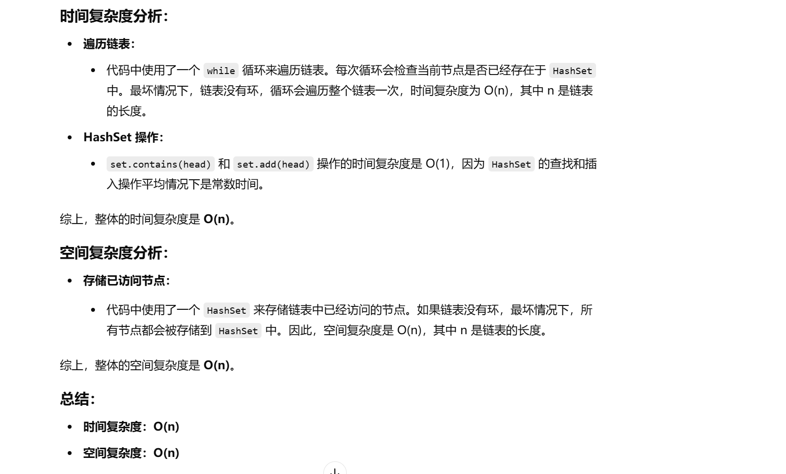
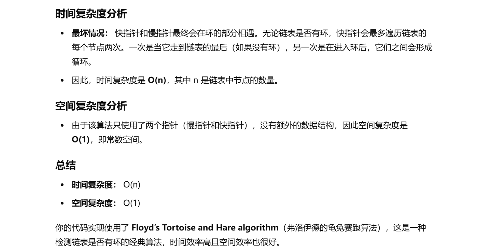

没做过


[141. 环形链表 - 力扣（LeetCode）](https://leetcode.cn/problems/linked-list-cycle/description/?envType=study-plan-v2&envId=top-100-liked)


# 自己想的哈希方法


```java
public class Solution {
    public boolean hasCycle(ListNode head) {
        // 1. 创建一个 HashSet 用来存储已经遍历过的节点
        Set<ListNode> set = new HashSet<>();

        // 2. 遍历链表
        while (head != null) {
            // 3. 如果当前节点已经在 HashSet 中，说明链表中有环，返回 true
            if (set.contains(head)) {
                return true;
            } else {
                // 4. 如果当前节点不在 HashSet 中，将其添加到 HashSet 中
                set.add(head);
            }
            // 5. 移动到下一个节点
            head = head.next;
        }

        // 6. 如果遍历结束还没有找到环，返回 false
        return false;
    }
}

```




# 不利用额外空间的方法


**我想起来了之前做的环形链表Ⅱ，有个快慢指针做法**


```java
public class Solution {
    // 判断链表是否有环
    public boolean hasCycle(ListNode head) {
        // 初始化慢指针，指向链表的头节点
        ListNode slow = head;
        // 初始化快指针，指向链表的头节点
        ListNode fast = head;
        
        // 当快指针和慢指针都不为null，继续遍历
        while (fast != null && fast.next != null) {
            slow = slow.next; // 慢指针每次移动一步
            fast = fast.next.next; // 快指针每次移动两步
            
            // 如果快指针和慢指针相遇，说明链表中有环
            if (slow == fast) {
                return true; // 有环，返回true
            }
        }
        
        // 快指针或快指针的下一个节点为null，说明没有环，返回false
        return false;
    }
}

```


