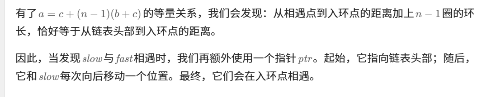

做过这题


知识点：快慢指针


[142. 环形链表 II - 力扣（LeetCode）](https://leetcode.cn/problems/linked-list-cycle-ii/description/?envType=study-plan-v2&envId=top-100-liked)


关于快慢指针：[环形链表II【基础算法精讲 07】_哔哩哔哩_bilibili](https://www.bilibili.com/video/BV1KG4y1G7cu/?vd_source=96c1635797a0d7626fb60e973a29da38)


```java
public class Solution {
    // 检测链表中是否有环，并返回环的入口节点
    public ListNode detectCycle(ListNode head) {
        // 初始化慢指针，指向链表的头节点
        ListNode slow = head;
        // 初始化快指针，指向链表的头节点
        ListNode fast = head;
        
        // 当快指针和慢指针都不为null，继续遍历
        while (fast != null && fast.next != null) {
            slow = slow.next; // 慢指针每次移动一步
            fast = fast.next.next; // 快指针每次移动两步
            
            // 如果快指针和慢指针相遇，说明链表中有环
            if (slow == fast) {
                // 当两指针相遇时，从头节点和慢指针同时出发，步数相同
                // 再次相遇的位置即为环的入口节点
                while (slow != head) {
                    slow = slow.next; // 慢指针每次移动一步
                    head = head.next; // 头指针每次移动一步
                }
                return slow; // 返回环的入口节点
            }
        }
        
        // 如果没有环，返回null
        return null;
    }
}

```


# 正确性推导过程


这是官解：[142. 环形链表 II - 力扣（LeetCode）](https://leetcode.cn/problems/linked-list-cycle-ii/solutions/441131/huan-xing-lian-biao-ii-by-leetcode-solution/?envType=study-plan-v2&envId=top-100-liked)


下面是灵神推导


