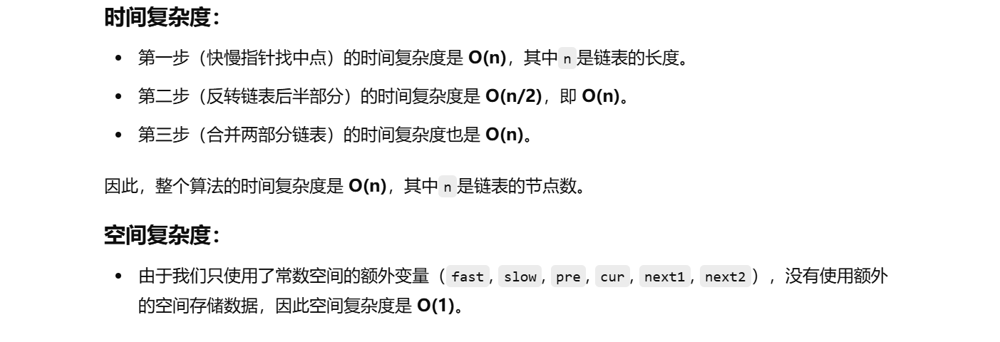

没做过


[143. 重排链表 - 力扣（LeetCode）](https://leetcode.cn/problems/reorder-list/description/)


[环形链表II【基础算法精讲 07】_哔哩哔哩_bilibili](https://www.bilibili.com/video/BV1KG4y1G7cu/?vd_source=96c1635797a0d7626fb60e973a29da38)


```java
class Solution {
    public void reorderList(ListNode head) {
        // Step 1: 使用快慢指针找到链表的中点
        ListNode fast = head;
        ListNode slow = head;
        
        // 快指针每次走两步，慢指针每次走一步，直到快指针到达链表末尾，慢指针就会停在链表的中间
        while (fast != null && fast.next != null) {
            fast = fast.next.next; // 快指针走两步
            slow = slow.next;      // 慢指针走一步
        }

        // Step 2: 反转链表的后半部分
        ListNode pre = null;  // 反转链表时的前一个节点
        ListNode cur = slow;  // 从中点开始反转链表
        while (cur != null) {
            ListNode next = cur.next;  // 保存当前节点的下一个节点
            cur.next = pre;            // 将当前节点的指针指向前一个节点
            pre = cur;                 // 前一个节点移动到当前节点
            cur = next;                // 当前节点移动到下一个节点
        }

        // Step 3: 合并两部分链表，交替连接
        ListNode head1 = head;  // 头部链表
        ListNode head2 = pre;   // 反转后的后半部分链表
        while (head2.next != null) {
            ListNode next1 = head1.next;  // 保存头部链表的下一个节点
            ListNode next2 = head2.next;  // 保存反转链表的下一个节点
            
            head1.next = head2;  // 将头部链表的当前节点指向反转后的链表
            head2.next = next1;  // 将反转链表的当前节点指向头部链表的下一个节点
            
            head1 = next1;  // 移动头部链表指针
            head2 = next2;  // 移动反转链表指针
        }
    }
}

```


