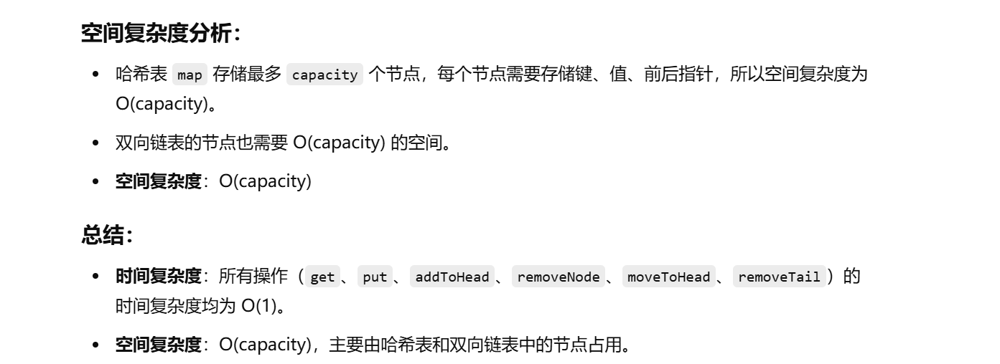

做过


[146. LRU 缓存 - 力扣（LeetCode）](https://leetcode.cn/problems/lru-cache/description/?envType=study-plan-v2&envId=top-100-liked)


忘了


左神：[算法讲解035【必备】数据结构设计高频题_哔哩哔哩_bilibili](https://www.bilibili.com/video/BV1nF411y7rD?spm_id_from=333.788.recommend_more_video.-1&vd_source=96c1635797a0d7626fb60e973a29da38)


灵神：[146. LRU 缓存 - 力扣（LeetCode）](https://leetcode.cn/problems/lru-cache/solutions/2456294/tu-jie-yi-zhang-tu-miao-dong-lrupythonja-czgt/?envType=study-plan-v2&envId=top-100-liked)


# 双向链表+哈希表


```java
class LRUCache {

    // 双向链表节点类
    class Node {
        int key;  // 节点的键值
        int val;  // 节点的值
        Node pre; // 前一个节点
        Node next; // 下一个节点

        // 默认构造函数
        public Node() {

        }

        // 带参数构造函数
        public Node(int key, int val) {
            this.key = key;
            this.val = val;
            this.pre = null;
            this.next = null;
        }
    }

    // 哈希映射，存储键与节点的映射关系
    Map<Integer, Node> map;
    // 当前缓存的大小
    int size;
    // 缓存的最大容量
    int capacity;
    // 双向链表的头部和尾部节点
    Node head, tail;

    // 构造函数，初始化缓存容量和链表头尾节点
    public LRUCache(int capacity) {
        map = new HashMap<>();  // 哈希表初始化
        size = 0;  // 初始缓存大小为0
        this.capacity = capacity;  // 设置最大缓存容量
        head = new Node();  // 创建虚拟头节点
        tail = new Node();  // 创建虚拟尾节点
        head.next = tail;  // 头节点的下一个是尾节点
        tail.pre = head;  // 尾节点的前一个是头节点
    }

    // 获取缓存中的值
    public int get(int key) {
        Node node = map.get(key);  // 在哈希表中找到对应的节点
        if (node == null) {
            return -1;  // 如果节点不存在，返回-1
        }
        moveToHead(node);  // 如果节点存在，移动该节点到头部
        return node.val;  // 返回节点的值
    }

    // 放入新的键值对
    public void put(int key, int value) {
        Node node = map.get(key);  // 查找是否已存在该键的节点
        if (node == null) {
            // 如果该键的节点不存在，创建新的节点
            Node newNode = new Node(key, value);
            addToHead(newNode);  // 将新节点添加到头部
            map.put(key, newNode);  // 将节点插入哈希表
            size++;  // 缓存大小增加
            if (size > capacity) {
                // 如果缓存已满，移除尾部节点
                Node delNode = removeTail();
                size--;  // 缓存大小减小
                map.remove(delNode.key);  // 从哈希表中移除该节点
            }
        } else {
            // 如果节点已存在，更新节点的值，并将其移到头部
            node.val = value;
            moveToHead(node);
        }
    }

    // 将节点添加到双向链表的头部
    public void addToHead(Node node) {
        node.next = head.next;  // 新节点的下一个是原头节点的下一个
        node.pre = head;  // 新节点的前一个是头节点
        head.next.pre = node;  // 原头节点的下一个节点的前一个是新节点
        head.next = node;  // 头节点的下一个是新节点
    }

    // 移除节点
    public void removeNode(Node node) {
        node.pre.next = node.next;  // 删除节点的前一个节点的下一个是删除节点的下一个节点
        node.next.pre = node.pre;  // 删除节点的下一个节点的前一个是删除节点的前一个节点
    }

    // 将节点移动到头部
    public void moveToHead(Node node) {
        removeNode(node);  // 先删除该节点
        addToHead(node);  // 再将该节点添加到头部
    }

    // 移除尾部节点并返回该节点
    public Node removeTail() {
        Node node = tail.pre;  // 获取尾部节点
        removeNode(node);  // 移除尾部节点
        return node;  // 返回被移除的节点
    }
}

```


