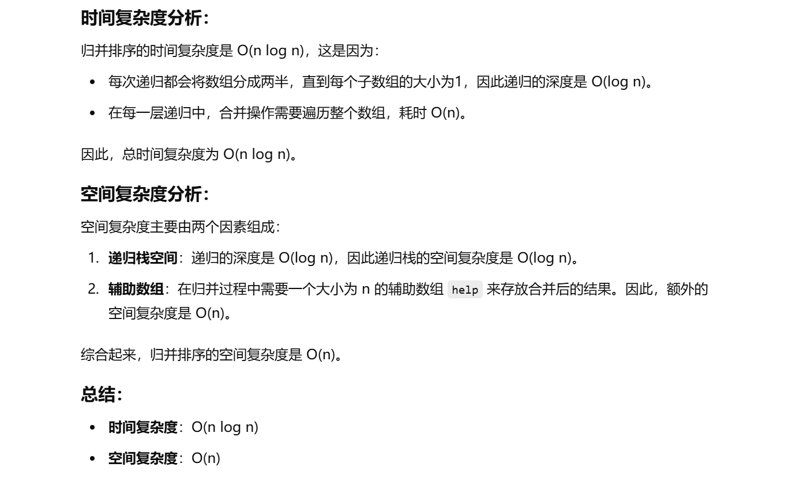
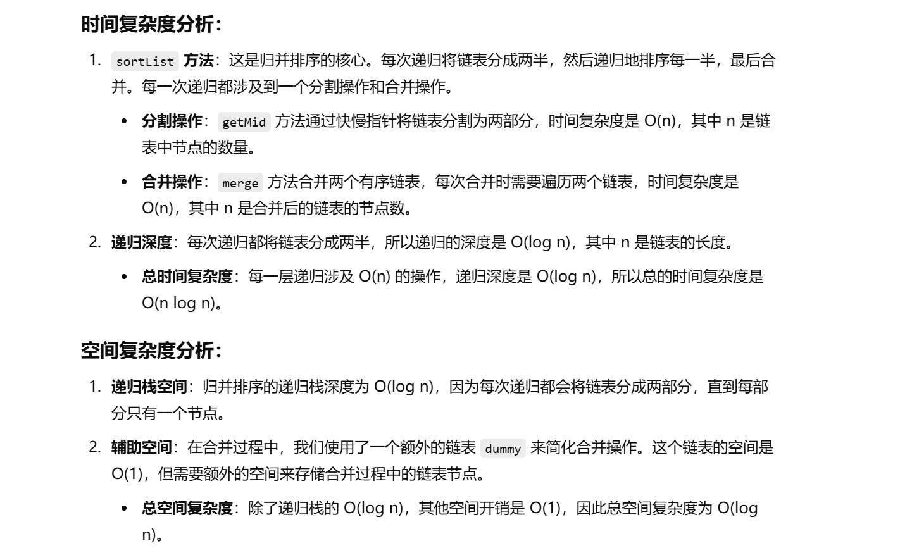

做过


[148. 排序链表 - 力扣（LeetCode）](https://leetcode.cn/problems/sort-list/description/?envType=study-plan-v2&envId=top-100-liked)


[算法讲解034【必备】链表高频题目和必备技巧_哔哩哔哩_bilibili](https://www.bilibili.com/video/BV1A14y1i7GY/?spm_id_from=333.1391.0.0&vd_source=96c1635797a0d7626fb60e973a29da38)


忘了排序算法了


**首先回顾一下归并排序算法的模板**

acm风格：[P1177 【模板】排序 - 洛谷 | 计算机科学教育新生态 (luogu.com.cn)](https://www.luogu.com.cn/problem/P1177)


# 归并排序模板（递归版）


```java
import java.io.*;
import java.util.*;

// 规定数据量的模板
public class Main {

    // arr用于存储待排序的数组，help用于归并排序中的辅助数组
    public static int[] arr;
    public static int[] help;

    public static void main(String[] args) throws IOException {
        // 使用BufferedReader读取输入数据，提高效率
        BufferedReader br = new BufferedReader(new InputStreamReader(System.in));
        // 创建StreamTokenizer来处理输入流，这种方式比Scanner更高效
        StreamTokenizer in = new StreamTokenizer(br);
        // 使用PrintWriter输出结果
        PrintWriter out = new PrintWriter(new OutputStreamWriter(System.out));

        // 读取数组的大小n
        in.nextToken();
        int n = (int) in.nval;
        // 初始化数组arr和辅助数组help
        arr = new int[n];
        help = new int[n];

        // 读取n个整数并存入arr数组
        for (int i = 0; i < n; i++) {
            in.nextToken();
            arr[i] = (int) in.nval;
        }

        // 定义左右边界l和r，初始值为0和n-1，表示待排序的整个数组
        int l = 0, r = n - 1;
        // 调用mergeSort方法进行排序
        mergeSort(l, r);

        // 输出排序后的数组，注意最后一个元素单独输出
        for (int i = 0; i < n - 1; i++) {
            out.print(arr[i] + " ");
        }
        out.println(arr[n - 1]); // 输出最后一个元素
        out.flush(); // 刷新输出流
        out.close(); // 关闭输出流
        br.close();  // 关闭输入流
    }

    // 归并排序方法
    private static void mergeSort(int l, int r) {
        // 递归结束条件：当区间只剩一个元素时，不需要再排序
        if (l == r) {
            return;
        }
        // 计算中间位置m
        int m = (r - l) / 2 + l;
        // 递归排序左半部分
        mergeSort(l, m);
        // 递归排序右半部分
        mergeSort(m + 1, r);
        // 合并左右两部分
        merge(l, m, r);
    }

    // 归并过程，将arr[l..m]和arr[m+1..r]两个部分合并成一个有序的数组
    private static void merge(int l, int m, int r) {
        int i = l;  // i用于遍历辅助数组help
        int a = l;  // a用于遍历arr[l..m]部分
        int b = m + 1; // b用于遍历arr[m+1..r]部分

        // 合并过程中，比较左半部分和右半部分的元素，较小的放入help数组
        while (a <= m && b <= r) {
            help[i++] = arr[a] <= arr[b] ? arr[a++] : arr[b++];
        }

        // 如果左半部分还有剩余，将剩余部分直接放入help
        while (a <= m) {
            help[i++] = arr[a++];
        }

        // 如果右半部分还有剩余，将剩余部分直接放入help
        while (b <= r) {
            help[i++] = arr[b++];
        }

        // 将排好序的元素从help数组拷贝回arr数组
        for (i = l; i <= r; i++) {
            arr[i] = help[i];
        }
    }
}

```





# 题目解法：归并排序（递归版）


题解：[148. 排序链表 - 力扣（LeetCode）](https://leetcode.cn/problems/sort-list/solutions/2993518/liang-chong-fang-fa-fen-zhi-die-dai-mo-k-caei/?envType=study-plan-v2&envId=top-100-liked)


```java
class Solution {
    // 主排序方法，使用归并排序对链表进行排序
    public ListNode sortList(ListNode head) {
        // 基本情况：如果链表为空或只有一个元素，直接返回
        if (head == null) {
            return null;
        }
        if (head.next == null) {
            return head;
        }

        // 1. 获取链表的中间节点
        ListNode head2 = getMid(head);
        // 2. 对链表的两部分分别递归排序
        head = sortList(head);
        head2 = sortList(head2);

        // 3. 合并两个已排序的链表
        return merge(head, head2);
    }

    // 获取链表的中间节点，采用快慢指针方法
    public ListNode getMid(ListNode head) {
        ListNode slow = head; // 慢指针，最终指向中间节点
        ListNode fast = head; // 快指针，遍历速度是慢指针的两倍
        ListNode pre = head;  // 记录慢指针的前一个节点，用于断开链表
        
        // 快慢指针，fast走两步，slow走一步，直到fast到达末尾
        while (fast != null && fast.next != null) {
            pre = slow;         // pre指向慢指针的前一个节点
            slow = slow.next;   // 慢指针向前移动一步
            fast = fast.next.next; // 快指针向前移动两步
        }
        
        // 将pre.next设为null，将链表分为两部分
        pre.next = null;
        return slow; // 返回链表的中间节点
    }

    // 合并两个已排序的链表
    public ListNode merge(ListNode list1, ListNode list2) {
        // 创建一个虚拟头节点，以简化链表合并操作
        ListNode dummy = new ListNode(0);
        ListNode cur = dummy; // cur指向虚拟头节点
        
        // 遍历两个链表，按照大小顺序合并节点
        while (list1 != null && list2 != null) {
            if (list1.val <= list2.val) {
                cur.next = list1; // 将list1当前节点接到cur后面
                list1 = list1.next; // list1向后移动
            } else {
                cur.next = list2; // 将list2当前节点接到cur后面
                list2 = list2.next; // list2向后移动
            }
            cur = cur.next; // cur向后移动
        }
        
        // 如果其中一个链表已经遍历完，将另一个链表剩余部分直接连接到cur后面
        cur.next = (list1 == null) ? list2 : list1;
        
        // 返回合并后的链表，虚拟头节点的下一个节点是合并后的链表的头
        return dummy.next;
    }
}

```



