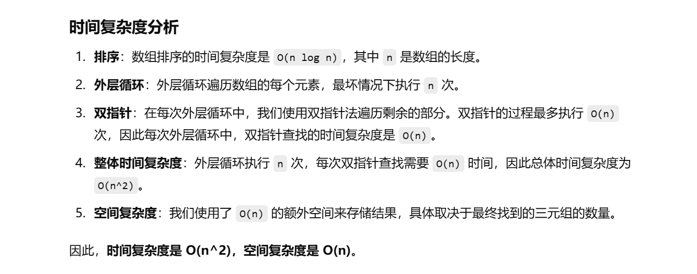

这个题目之前做过


[15. 三数之和 - 力扣（LeetCode）](https://leetcode.cn/problems/3sum/?envType=study-plan-v2&envId=top-100-liked)


知识点：双指针


# 自己想出来的一个方法，较慢


自己想的使用哈希表来去重，但是没有用到数组有序这个条件

```java
    class Solution {
        public List<List<Integer>> threeSum(int[] nums) {
            Arrays.sort(nums);
            Set<List<Integer>> set = new HashSet<>();


            if (nums[nums.length - 1] < 0) {
                return new ArrayList<>();
            }
            for (int i = 0; i < nums.length; i++) {
                int target = 0 - nums[i];
                int j = i + 1, k = nums.length - 1;
                while (j < k) {
                    if (nums[j] + nums[k] < target) {
                        j++;
                    } else if (nums[j] + nums[k] > target) {
                        k--;
                    } else {
                        List<Integer> temp = new ArrayList<>();
                        temp.add(nums[i]);
                        temp.add(nums[j]);
                        temp.add(nums[k]);
                        set.add(temp);
                        j++;
                    }
                }
            }
            return new ArrayList<>(set);
        }
    }
```


# 正确做法


```java
class Solution {
    public List<List<Integer>> threeSum(int[] nums) {
        // 对数组进行排序，使得我们可以利用双指针方法来找到三数之和为零的三元组
        Arrays.sort(nums);
        
        // 创建一个List来存储最终的三元组结果
        List<List<Integer>> ans = new ArrayList<>();

        // 如果数组的最大值小于0，说明无法组成三元组，因为最小值是负数
        if (nums[nums.length - 1] < 0) {
            return new ArrayList<>();
        }

        // 外层循环遍历每个数 nums[i]，作为三元组的第一个数
        for (int i = 0; i < nums.length; i++) {
            // 去重：如果 nums[i] 和前一个数相同，跳过当前数，避免重复的三元组
            if (i > 0 && nums[i] == nums[i - 1]) {
                continue;
            }

            // 目标值是 0 - nums[i]，即我们需要找到两个数的和等于 target
            int target = 0 - nums[i];
            
            // 初始化双指针，j 从 i+1 开始，k 从数组末尾开始
            int j = i + 1, k = nums.length - 1;

            // 使用双指针法找到两个数之和为 target 的情况
            while (j < k) {
                // 如果 nums[j] + nums[k] 小于 target，则需要增大 j，尝试更大的值
                if (nums[j] + nums[k] < target) {
                    j++;
                } 
                // 如果 nums[j] + nums[k] 大于 target，则需要减小 k，尝试更小的值
                else if (nums[j] + nums[k] > target) {
                    k--;
                } 
                // 如果找到 nums[j] + nums[k] == target，说明找到了一个三元组
                else {
                    // 将当前的三元组添加到结果列表中
                    ans.add(List.of(nums[i], nums[j], nums[k]));
                    
                    // 跳过重复的左边元素，确保不重复的三元组
                    while (j < k && nums[j] == nums[j + 1]) {
                        j++;  // 跳过重复的左边元素
                    }
                    
                    // 跳过重复的右边元素，确保不重复的三元组
                    while (j < k && nums[k] == nums[k - 1]) {
                        k--;  // 跳过重复的右边元素
                    }
                    
                    // 移动指针，继续查找下一个可能的三元组
                    j++;
                    k--;
                }
            }
        }

        // 返回最终找到的所有不重复的三元组
        return ans;
    }
}

```


