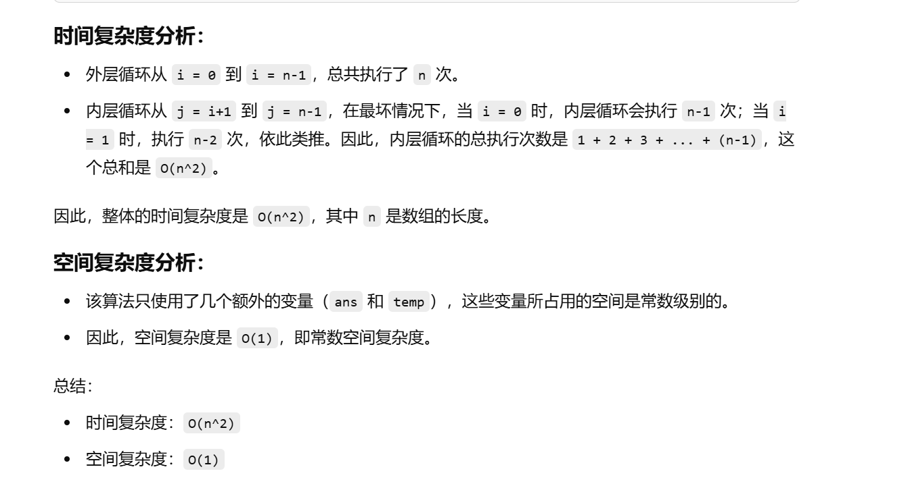
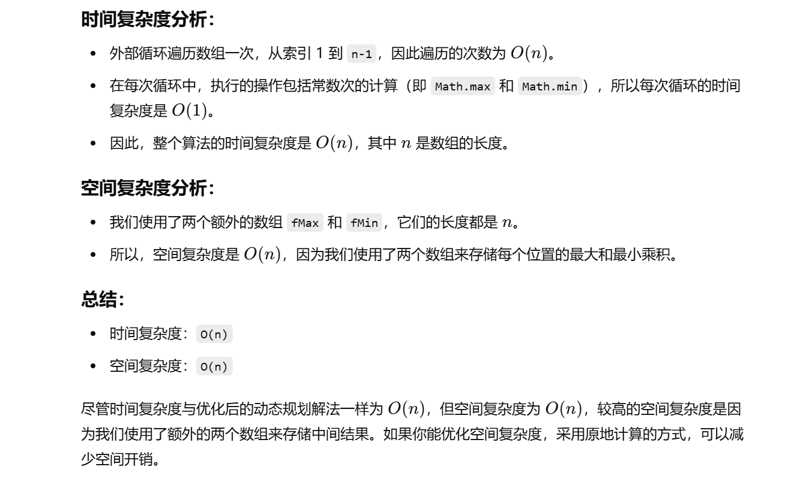

没做过


[152. 乘积最大子数组 - 力扣（LeetCode）](https://leetcode.cn/problems/maximum-product-subarray/description/?envType=study-plan-v2&envId=top-100-liked)


# 自己写的暴力（竟然通过了？）

```java
class Solution {
    // 定义函数 maxProduct，接受一个整数数组 nums
    public int maxProduct(int[] nums) {
        // 获取数组长度
        int n = nums.length;
        // 初始化 ans 为最小值，以便之后的比较
        int ans = Integer.MIN_VALUE;

        // 外层循环遍历数组中的每一个元素，从第一个元素开始
        for (int i = 0; i < n; i++) {
            // 初始化 temp 为当前元素 nums[i]，temp 用来存储从 i 到 j 的乘积
            int temp = nums[i];
            // 更新 ans 为当前 temp 和 ans 中的较大值
            ans = Math.max(ans, temp);

            // 内层循环遍历从 i+1 到 n-1 的每个元素，计算子数组的乘积
            for (int j = i + 1; j < n; j++) {
                // 更新 temp，temp 为从 nums[i] 到 nums[j] 的乘积
                temp *= nums[j];
                // 更新 ans 为当前 temp 和 ans 中的较大值
                ans = Math.max(ans, temp);
            }
        }
        // 返回最大乘积
        return ans;
    }
}

```





# 正确写法


```java
class Solution {
    public int maxProduct(int[] nums) {
        int n = nums.length;
        
        // 创建两个数组 fMax 和 fMin，分别用于记录当前元素 nums[i] 为右端点的子数组的最大和最小乘积
        int[] fMax = new int[n];
        int[] fMin = new int[n];
        
        // 初始化第一个元素，fMax[0] 和 fMin[0] 都等于 nums[0]
        fMax[0] = fMin[0] = nums[0];
        
        // 初始化 ans 为数组的第一个元素
        int ans = nums[0];
        
        // 从数组的第二个元素开始遍历
        for (int i = 1; i < n; i++) {
            int x = nums[i];
            
            // 计算当前元素 x 加到右端点为 i-1 的子数组后面时的最大和最小乘积，或者单独形成一个新的子数组，只有 x 一个元素
            // fMax[i] 表示当前元素作为右端点的子数组的最大乘积
            // fMin[i] 表示当前元素作为右端点的子数组的最小乘积
            fMax[i] = Math.max(Math.max(fMax[i - 1] * x, fMin[i - 1] * x), x);
            fMin[i] = Math.min(Math.min(fMax[i - 1] * x, fMin[i - 1] * x), x);
            
            // 更新最终的答案，ans 是所有 fMax[i] 中的最大值
            ans = Math.max(ans, fMax[i]);
        }
        
        // 返回最终的最大乘积
        return ans;
    }
}

```


