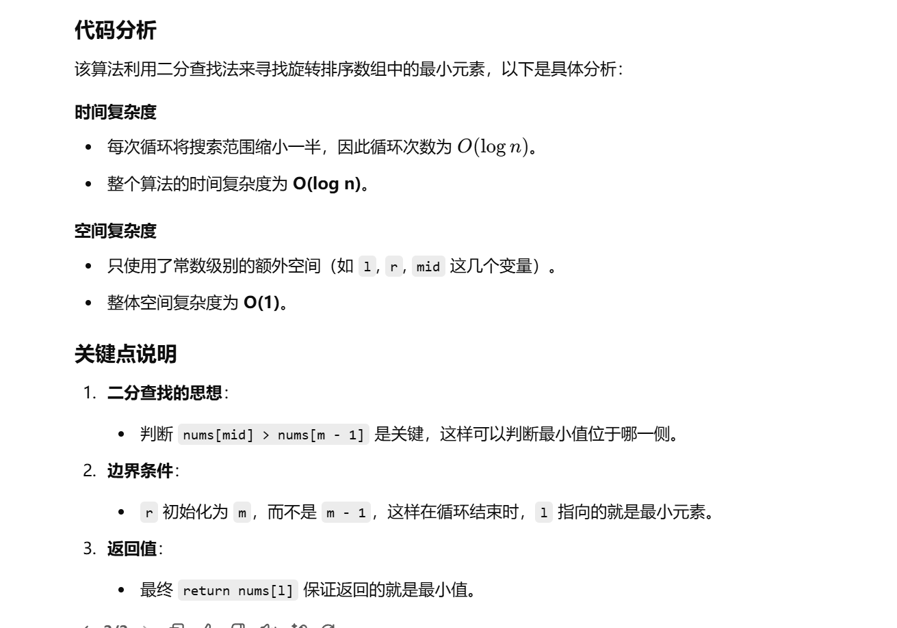

没做过


知识点：二分


[153. 寻找旋转排序数组中的最小值 - 力扣（LeetCode）](https://leetcode.cn/problems/find-minimum-in-rotated-sorted-array/description/?envType=study-plan-v2&envId=top-100-liked)


[153. 寻找旋转排序数组中的最小值 - 力扣（LeetCode）](https://leetcode.cn/problems/find-minimum-in-rotated-sorted-array/solutions/1987499/by-endlesscheng-owgd/?envType=study-plan-v2&envId=top-100-liked)


```java
class Solution {
    public int findMin(int[] nums) {
        // 获取数组长度
        int m = nums.length;

        // 初始化左右指针，左指针指向起始位置，右指针指向数组末尾的下一个位置
        int l = 0, r = m;

        // 使用二分查找，循环条件为左指针小于右指针
        while (l < r) {
            // 计算中点，避免整型溢出
            int mid = (r - l) / 2 + l;

            // 如果中点元素大于数组最后一个元素
            // 说明最小值在右侧（旋转后的数组特性）
            if (nums[mid] > nums[m - 1]) {
                // 将左指针移动到中点右侧
                l = mid + 1;
            } else {
                // 否则，最小值可能在中点或其左侧
                r = mid;
            }
        }

        // 最小值位于左指针指向的位置
        return nums[l];
    }
}

```



