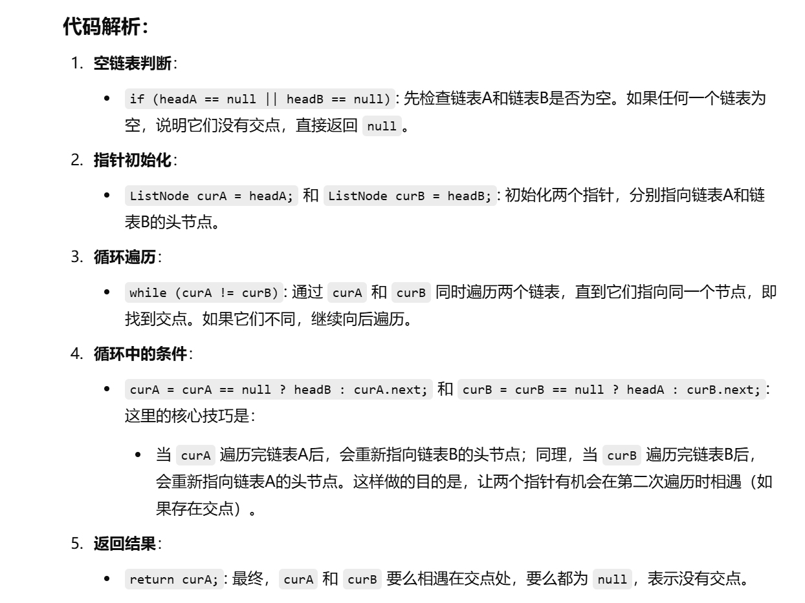

之前做过这题


[160. 相交链表 - 力扣（LeetCode）](https://leetcode.cn/problems/intersection-of-two-linked-lists/description/?envType=study-plan-v2&envId=top-100-liked)


知识点：


# 我自己想的做法，和之前做过的一遍做法一样


```java
public class Solution {
    public ListNode getIntersectionNode(ListNode headA, ListNode headB) {
        int sizeA = 0; // 用来记录链表A的长度
        int sizeB = 0; // 用来记录链表B的长度
        ListNode curA = headA; // 设置curA为链表A的头节点
        ListNode curB = headB; // 设置curB为链表B的头节点
        
        // 计算链表A的长度
        while (curA != null) {
            curA = curA.next; // 移动到下一个节点
            sizeA++; // 增加链表A的长度
        }
        
        // 计算链表B的长度
        while (curB != null) {
            curB = curB.next; // 移动到下一个节点
            sizeB++; // 增加链表B的长度
        }
        
        // 重置curA和curB为链表的头节点
        curA = headA;
        curB = headB;

        // 如果链表B的长度大于链表A，则让curB先移动到与curA相同的起始位置
        if (sizeB > sizeA) {
            while (sizeB > sizeA) {
                sizeB--; // 减少链表B的长度
                curB = curB.next; // curB向后移动
            }
        } 
        // 如果链表A的长度大于链表B，则让curA先移动到与curB相同的起始位置
        else if (sizeB < sizeA) {
            while (sizeB < sizeA) {
                sizeA--; // 减少链表A的长度
                curA = curA.next; // curA向后移动
            }
        }

        // 此时，curA和curB在同样的起始位置，开始同时遍历两个链表
        while (curA != null && curA != curB) {
            curA = curA.next; // 移动到链表A的下一个节点
            curB = curB.next; // 移动到链表B的下一个节点
        }

        // 如果curA和curB相等，说明找到了交点，否则返回null
        return curA;
    }
}

```


# 官解：双指针解法


[160. 相交链表 - 力扣（LeetCode）](https://leetcode.cn/problems/intersection-of-two-linked-lists/solutions/811625/xiang-jiao-lian-biao-by-leetcode-solutio-a8jn/?envType=study-plan-v2&envId=top-100-liked)


```java
public class Solution {
    public ListNode getIntersectionNode(ListNode headA, ListNode headB) {
        // 如果链表A或链表B为空，说明没有交点，直接返回null
        if (headA == null || headB == null) {
            return null;
        }
        
        // 初始化两个指针curA和curB，分别指向链表A和链表B的头节点
        ListNode curA = headA;
        ListNode curB = headB;

        // 当curA和curB指向同一个节点时，说明找到了交点
        // 如果curA和curB不同，继续遍历
        while (curA != curB) {
            // 如果curA到达链表A的末尾，则将其指向链表B的头节点
            // 否则，继续向后遍历链表A
            curA = curA == null ? headB : curA.next;

            // 如果curB到达链表B的末尾，则将其指向链表A的头节点
            // 否则，继续向后遍历链表B
            curB = curB == null ? headA : curB.next;
        }
        
        // 最终，curA和curB要么相遇于交点，要么都为null（说明没有交点）
        return curA;
    }
}

```




