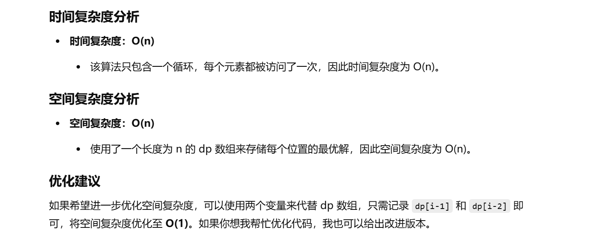

做过


[198. 打家劫舍 - 力扣（LeetCode）](https://leetcode.cn/problems/house-robber/description/?envType=study-plan-v2&envId=top-100-liked)


```java
class Solution {
    // 该方法用于解决“打家劫舍”问题，输入为一个整数数组 nums，每个元素代表每户人家的财产
    public int rob(int[] nums) {
        // 边界情况：若数组为空，直接返回0
        if (nums == null || nums.length == 0) {
            return 0;
        }
        
        int n = nums.length; // 数组长度（房屋数量）
        
        // 边界情况：若仅有一户人家，直接返回该户财产
        if (n == 1) {
            return nums[0];
        }

        // 创建dp数组，dp[i] 表示在第 i 户时可偷窃的最大金额
        int[] dp = new int[n];
        
        // 初始化dp数组的前两项
        dp[0] = nums[0]; // 第一个房屋只能选择偷它本身
        dp[1] = Math.max(nums[0], nums[1]); // 第二个房屋取决于是否偷第一个房屋
        
        // 从第3个房屋开始遍历，计算每一户的最优解
        for (int i = 2; i < n; i++) {
            // 状态转移方程：
            // dp[i] = max(偷当前房屋 + 两步前的最优解，不偷当前房屋且沿用前一步最优解)
            dp[i] = Math.max(dp[i - 2] + nums[i], dp[i - 1]);
        }

        // 返回最后一户的最优解
        return dp[n - 1];
    }
}

```


