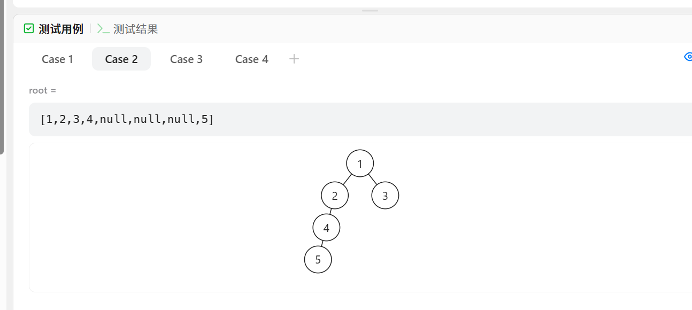

做过


[199. 二叉树的右视图 - 力扣（LeetCode）](https://leetcode.cn/problems/binary-tree-right-side-view/?envType=study-plan-v2&envId=top-100-liked)


# 自己想的递归

不对

```java
    class Solution {
        public List<Integer> rightSideView(TreeNode root) {
            List<Integer> ans = new ArrayList<>();
            dfs(root, ans);
            return ans;
        }

        public void dfs(TreeNode root, List<Integer> ans) {
            if (root == null) {
                return;
            }
            ans.add(root.val);
            if (root.left == null && root.right == null) {
                return;
            }
            if (root.right != null) {
                dfs(root.right, ans);
            } else {
                dfs(root.left, ans);
            }
        }
    }
```


改了一种方法还是不对

```java
    class Solution {
        public List<Integer> rightSideView(TreeNode root) {
            List<Integer> ans = new ArrayList<>();
            if (root == null) {
                return ans;
            }
            dfs(root, ans, 1);
            return ans;
        }

        public void dfs(TreeNode root, List<Integer> ans, int depth) {
            if (ans.size() < depth) {
                ans.add(root.val);
            }
            if (root.left == null && root.right == null) {
                return;
            }
            if (root.right != null) {
                dfs(root.right, ans, depth + 1);
            } else {
                dfs(root.left, ans, depth + 1);
            }
        }
    }
```


又改了一次对了

```java
    class Solution {
        public List<Integer> rightSideView(TreeNode root) {
            List<Integer> ans = new ArrayList<>();
            dfs(root, ans, 1);
            return ans;
        }

        public void dfs(TreeNode root, List<Integer> ans, int depth) {
            if (root == null) {
                return;
            }
            if (ans.size() < depth) {
                ans.add(root.val);
            }
            if (root.left == null && root.right == null) {
                return;
            }
            dfs(root.right, ans, depth + 1);
            dfs(root.left, ans, depth + 1);
        }
    }
```


不对的原因主要就下面这个用例，没考虑全情况




其实和灵神解法一样，只是深度设置不一样

灵神题解：[199. 二叉树的右视图 - 力扣（LeetCode）](https://leetcode.cn/problems/binary-tree-right-side-view/solutions/2015061/ru-he-ling-huo-yun-yong-di-gui-lai-kan-s-r1nc/?envType=study-plan-v2&envId=top-100-liked)

```java
class Solution {
    // 主函数，返回二叉树的右视图
    public List<Integer> rightSideView(TreeNode root) {
        // 存储右视图的结果
        List<Integer> ans = new ArrayList<>();
        // 从根节点开始深度优先搜索（DFS），并传入深度为1
        dfs(root, ans, 1);
        return ans;
    }

    // 深度优先搜索（DFS）函数
    public void dfs(TreeNode root, List<Integer> ans, int depth) {
        // 如果当前节点为空，直接返回
        if (root == null) {
            return;
        }
        
        // 如果右视图的列表中没有当前深度的节点，则说明当前节点是这一层的右视图节点
        if (ans.size() < depth) {
            ans.add(root.val);
        }
        
        // 如果当前节点是叶子节点（没有左右子节点），直接返回
        if (root.left == null && root.right == null) {
            return;
        }
        
        // 先遍历右子树，再遍历左子树。因为我们想要先看到右子树的节点（右视图）
        dfs(root.right, ans, depth + 1);
        dfs(root.left, ans, depth + 1);
    }
}

```


# 自己做出的层序遍历


```java
class Solution {
    // 定义右视图函数
    public List<Integer> rightSideView(TreeNode root) {
        // 用于广度优先遍历的队列
        Deque<TreeNode> queue = new LinkedList<>();
        // 存储右视图的结果
        List<Integer> ans = new ArrayList<>();
        
        // 如果树为空，直接返回空的结果
        if (root == null) {
            return ans;
        }
        
        // 将根节点放入队列
        queue.offer(root);
        
        // 进行广度优先遍历
        while (!queue.isEmpty()) {
            // 当前层的节点数
            int size = queue.size();
            
            // 遍历当前层的每个节点
            for (int i = 0; i < size; i++) {
                // 从队列中取出当前节点
                TreeNode node = queue.pollFirst();
                
                // 只在当前层的第一个节点添加到结果
                if (i < 1) {
                        ans.add(node.val);
                 }
                
                // 将右子节点先加入队列
                if (node.right != null) {
                    queue.offerLast(node.right);
                }
                
                // 然后将左子节点加入队列
                if (node.left != null) {
                    queue.offerLast(node.left);
                }
            }
        }
        
        // 返回右视图的结果
        return ans;
    }
}

```

