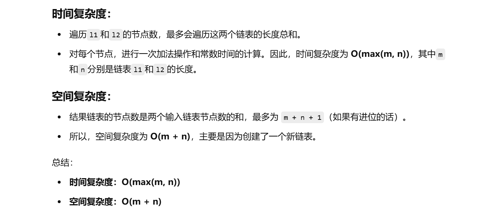

做过


[2. 两数相加 - 力扣（LeetCode）](https://leetcode.cn/problems/add-two-numbers/description/?envType=study-plan-v2&envId=top-100-liked)


知识点：模拟


# 自己做的

```java
    class Solution {
        public ListNode addTwoNumbers(ListNode l1, ListNode l2) {
            // 创建一个虚拟头节点，用来简化链表操作，cur用来指向当前操作的节点
            ListNode dummy = new ListNode(-1);
            ListNode cur = dummy;

            // 进位标志，初始值为0
            int carry = 0;

            // 遍历两个链表，直到两个链表都遍历完
            while (l1 != null && l2 != null) {
                // 计算当前节点的和，包括进位
                int temp = l1.val + l2.val + carry;

                // 当前节点的值为和的个位数
                cur.next = new ListNode(temp % 10);

                // 计算进位，整除10得到的值是进位
                carry = temp / 10;

                // 移动cur到下一个节点
                cur = cur.next;

                // 移动l1和l2到下一个节点
                l1 = l1.next;
                l2 = l2.next;
            }

            // 判断哪个链表遍历完了，剩余的链表直接连接
            ListNode l3 = l1 == null ? l2 : l1;

            // 如果没有进位，直接连接剩余部分
            if (carry == 0) {
                cur.next = l3;
            } else {
                // 如果有进位，继续处理剩余链表
                while (l3 != null) {
                    int temp = l3.val + carry;

                    // 当前节点的值为和的个位数
                    cur.next = new ListNode(temp % 10);

                    // 计算进位
                    carry = temp / 10;

                    // 移动cur到下一个节点
                    cur = cur.next;

                    // 移动l3到下一个节点
                    l3 = l3.next;
                }

                // 如果最终仍然有进位，创建一个新的节点
                if (carry != 0) {
                    cur.next = new ListNode(carry);
                }
            }

            // 返回结果链表的头节点，dummy.next为实际的头节点
            return dummy.next;
        }
    }

```


