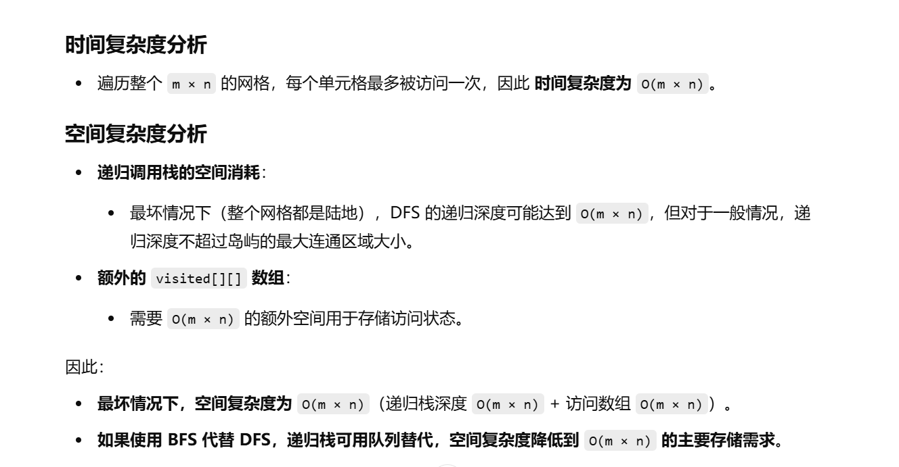

做过


[200. 岛屿数量 - 力扣（LeetCode）](https://leetcode.cn/problems/number-of-islands/description/?envType=study-plan-v2&envId=top-100-liked)


秒杀


```java
class Solution {
    // 计算网格中的岛屿数量
    public int numIslands(char[][] grid) {
        // 获取网格的行数 m 和列数 n
        int m = grid.length;
        int n = grid[0].length;
        // 创建访问数组，记录某个位置是否已被访问
        boolean[][] visited = new boolean[m][n];
        // 记录岛屿的数量
        int ans = 0;

        // 遍历整个网格
        for (int i = 0; i < m; i++) {
            for (int j = 0; j < n; j++) {
                // 如果当前是陆地 ('1') 且未被访问，则发现一个新岛屿
                if (grid[i][j] == '1' && !visited[i][j]) {
                    ans++; // 计数器 +1
                    // 进行深度优先搜索（DFS），标记该岛屿的所有陆地
                    dfs(grid, visited, i, j, m, n);
                }
            }
        }
        return ans; // 返回岛屿总数
    }

    // 深度优先搜索（DFS）：遍历并标记当前岛屿的所有陆地
    public void dfs(char[][] grid, boolean[][] visited, int i, int j, int m, int n) {
        // 边界条件检查：
        // 1. 超出网格范围
        // 2. 已访问过
        // 3. 遇到水 ('0')，停止搜索
        if (i < 0 || j < 0 || i > m - 1 || j > n - 1 || visited[i][j] || grid[i][j] == '0') {
            return;
        }

        // 标记当前节点为已访问
        visited[i][j] = true;

        // 递归探索四个方向的相邻陆地
        dfs(grid, visited, i - 1, j, m, n); // 上
        dfs(grid, visited, i + 1, j, m, n); // 下
        dfs(grid, visited, i, j - 1, m, n); // 左
        dfs(grid, visited, i, j + 1, m, n); // 右
    }
}

```



