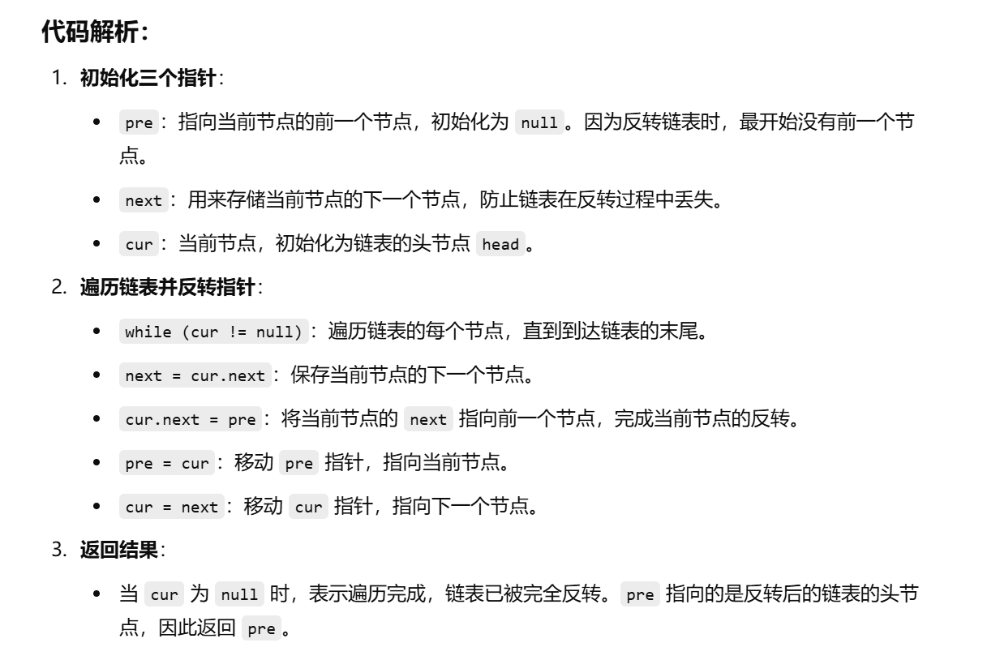
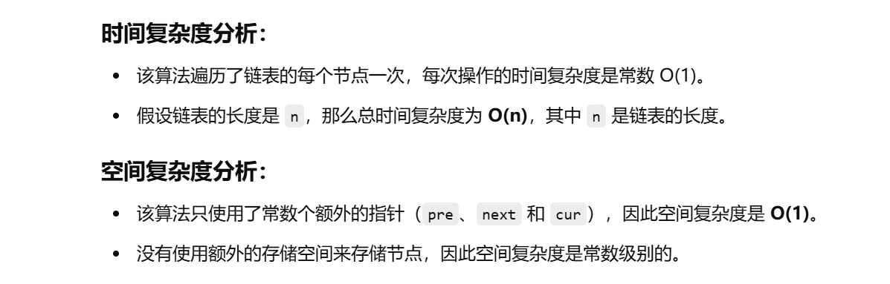

之前做过这题


[206. 反转链表 - 力扣（LeetCode）](https://leetcode.cn/problems/reverse-linked-list/description/?envType=study-plan-v2&envId=top-100-liked)


已经是默写的程度了


```java
class Solution {
    public ListNode reverseList(ListNode head) {
        // 初始化三个指针：pre、next 和 cur
        // pre 用于记录反转后的链表的前一个节点，初始化为 null
        // next 用于临时保存 cur.next，防止链表丢失
        // cur 是当前正在处理的节点，初始化为头节点
        ListNode pre = null;
        ListNode next = null;
        ListNode cur = head;

        // 遍历链表直到 cur 为空（即链表遍历完）
        while (cur != null) {
            // 临时保存当前节点的下一个节点
            next = cur.next;
            
            // 反转当前节点的指针，使其指向前一个节点
            cur.next = pre;
            
            // 移动 pre 和 cur 指针
            pre = cur;  // pre 指向当前节点，成为下一个节点的前驱
            cur = next; // cur 移动到下一个节点
        }

        // 返回反转后的链表头节点，即原链表的最后一个节点
        return pre;
    }
}

```





