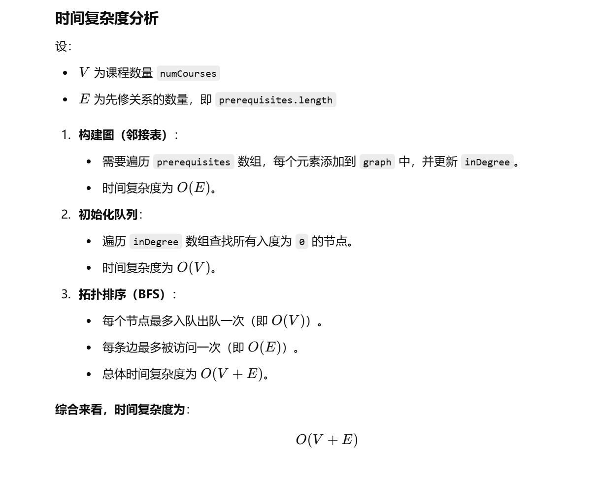
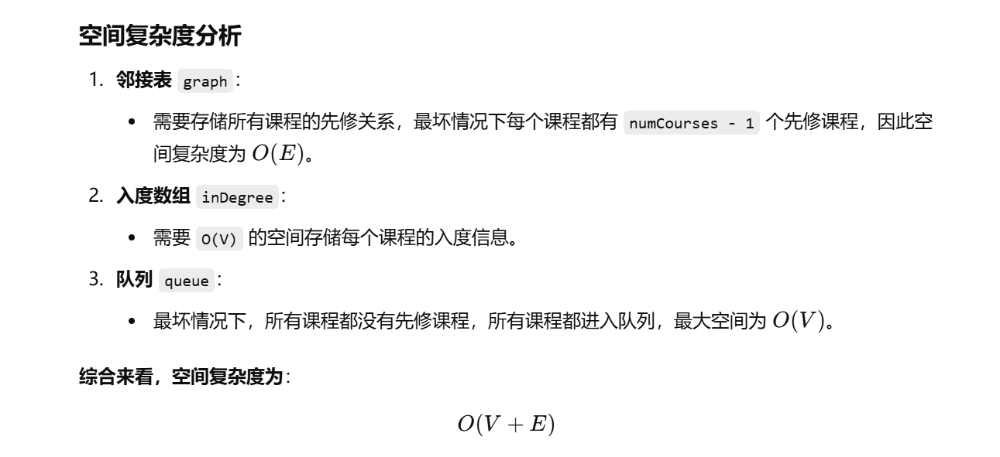

没做过，但是看题意好像就是拓扑排序


[207. 课程表 - 力扣（LeetCode）](https://leetcode.cn/problems/course-schedule/description/?envType=study-plan-v2&envId=top-100-liked)


好像就是和[210. 课程表 II - 力扣（LeetCode）](https://leetcode.cn/problems/course-schedule-ii/description/)一个题目


```java
import java.util.*;

class Solution {
    public boolean canFinish(int numCourses, int[][] prerequisites) {

        // 构建邻接表来表示课程的先修关系
        List<List<Integer>> graph = new ArrayList<>();
        for (int i = 0; i < numCourses; i++) {
            graph.add(new ArrayList<>()); // 初始化图中每个课程的邻接表
        }

        // 构建入度数组，记录每门课程的前置课程数量
        int[] inDegree = new int[numCourses];
        for (int[] course : prerequisites) {
            graph.get(course[1]).add(course[0]); // 课程 course[1] 指向 course[0]
            inDegree[course[0]]++; // 课程 course[0] 的入度加 1
        }

        // 创建队列用于拓扑排序，存放所有入度为 0 的课程
        Deque<Integer> queue = new ArrayDeque<>();
        for (int i = 0; i < inDegree.length; i++) {
            if (inDegree[i] == 0) { // 没有前置课程的课程可以直接开始学习
                queue.offer(i);
            }
        }

        // 记录已经被学习的课程数量
        int pollNum = 0;

        // 拓扑排序
        while (!queue.isEmpty()) {
            int cur = queue.poll(); // 取出当前可以学习的课程
            pollNum++; // 记录已经学习的课程数量

            // 遍历当前课程的所有后续课程
            for (int next : graph.get(cur)) {
                inDegree[next]--; // 当前课程被学习后，后续课程的入度减 1
                if (inDegree[next] == 0) { // 如果后续课程的入度变为 0，则可以学习
                    queue.offer(next);
                }
            }
        }

        // 如果学习的课程数量等于总课程数，则可以完成所有课程，否则不行
        return pollNum == numCourses;
    }
}

```






