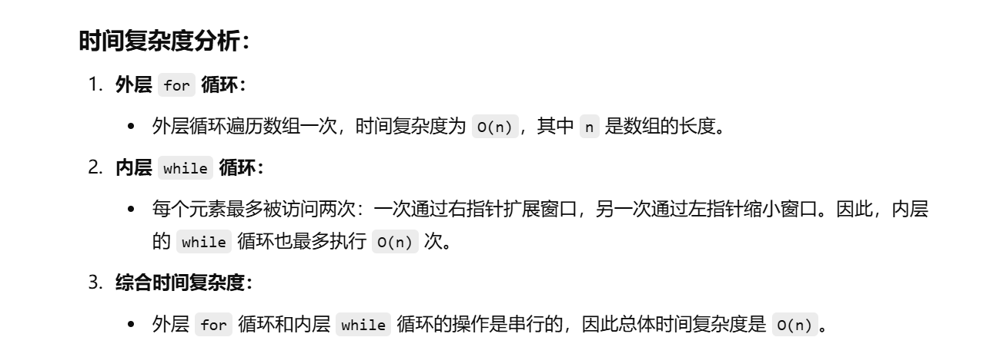

这个题目之前做过


知识点：滑动窗口


[209. 长度最小的子数组 - 力扣（LeetCode）](https://leetcode.cn/problems/minimum-size-subarray-sum/description/)


[滑动窗口【基础算法精讲 03】_哔哩哔哩_bilibili](https://www.bilibili.com/video/BV1hd4y1r7Gq/?vd_source=96c1635797a0d7626fb60e973a29da38)


```java
class Solution {
    public int minSubArrayLen(int target, int[] nums) {
        int l = 0;  // 左指针，初始为0
        int n = nums.length;  // 数组长度
        int ans = Integer.MAX_VALUE;  // 存储最小长度，初始化为最大值，表示尚未找到满足条件的子数组
        int sum = 0;  // 当前子数组的和，初始为0
        
        // 遍历数组的右指针r，从0到n-1
        for (int r = 0; r < n; r++) {
            sum += nums[r];  // 向右扩展窗口，将当前元素nums[r]加入到子数组的和中
            
            // 当当前子数组的和sum大于或等于target时，尝试缩小窗口
            while (l <= r && sum >= target) {
                ans = Math.min(ans, r - l + 1);  // 计算当前子数组的长度并更新最小长度ans
                sum -= nums[l];  // 将窗口的左边元素nums[l]从sum中减去，收缩窗口
                l++;  // 将左指针l向右移动
            }
        }
        
        // 如果没有找到符合条件的子数组，返回0，否则返回最小的子数组长度
        return ans == Integer.MAX_VALUE ? 0 : ans;
    }
}

```



