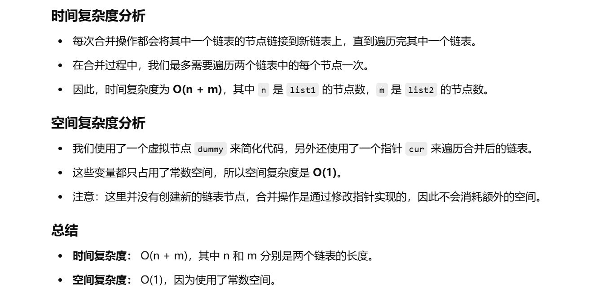

做过


[21. 合并两个有序链表 - 力扣（LeetCode）](https://leetcode.cn/problems/merge-two-sorted-lists/description/?envType=study-plan-v2&envId=top-100-liked)


知识点：简单的模拟题


```java
class Solution {
    // 合并两个已排序的链表并返回新的链表
    public ListNode mergeTwoLists(ListNode list1, ListNode list2) {
        // 创建一个虚拟节点dummy，用于方便返回合并后的链表头
        ListNode dummy = new ListNode(-1);
        // 当前指针cur，初始化指向dummy节点
        ListNode cur = dummy;

        // 当有一个链表为空时，跳出循环
        while (list1 != null || list2 != null) {
            // 如果list1为空，则直接将list2接到当前节点后
            if (list1 == null) {
                cur.next = list2;
                break; // 合并完成，跳出循环
            }
            // 如果list2为空，则直接将list1接到当前节点后
            if (list2 == null) {
                cur.next = list1;
                break; // 合并完成，跳出循环
            }

            // 如果list1当前节点的值小于等于list2的当前节点的值，将list1的节点接到当前节点后
            if (list1.val <= list2.val) {
                cur.next = list1;
                list1 = list1.next; // list1指针向前移动
            } else {
                // 如果list2当前节点的值小于list1的当前节点的值，将list2的节点接到当前节点后
                cur.next = list2;
                list2 = list2.next; // list2指针向前移动
            }
            // 当前指针移动到下一节点
            cur = cur.next;
        }
        
        // 返回dummy.next，即合并后的链表头
        return dummy.next;
    }
}

```


