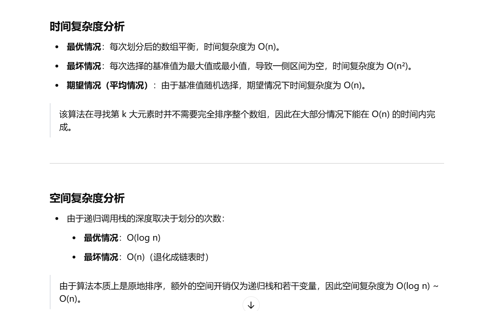

做过


[215. 数组中的第K个最大元素 - 力扣（LeetCode）](https://leetcode.cn/problems/kth-largest-element-in-an-array/description/?envType=study-plan-v2&envId=top-100-liked)


不会做了


[算法讲解024【必备】随机选择算法_哔哩哔哩_bilibili](https://www.bilibili.com/video/BV1mN411b71K/?spm_id_from=333.1387.list.card_archive.click&vd_source=96c1635797a0d7626fb60e973a29da38)


```java
class Solution {
    // 存储结果的变量
    int ans = 0;

    // 记录当前分区的起始和结束位置
    int first;
    int last;

    // 主方法，寻找数组中第 k 大的元素
    public int findKthLargest(int[] nums, int k) {
        // 调用快速排序变种方法，将目标位置的元素找到
        // 第 k 大的元素实际上是 nums.length - k 位置的元素
        quickSort(nums, 0, nums.length - 1, nums.length - k);
        return ans; // 返回最终结果
    }

    // 快速排序变种，专注于找到第 i 个位置的元素
    public void quickSort(int[] nums, int l, int r, int i) {
        if (l > r) {
            return; // 越界时返回
        }
        
        // 随机选择一个基准值，避免最坏情况下的 O(n^2)
        int x = nums[l + (int) (Math.random() * (r - l + 1))];
        
        // 将数组划分成 <x、=x、>x 的三部分
        partition(nums, l, r, x);
        
        // 获取左侧区域和右侧区域的边界
        int left = first - 1;
        int right = last + 1;
        
        // 判断目标元素 i 所在的位置，并递归搜索
        if (i < first) {
            quickSort(nums, l, left, i);  // 目标值在左侧区间
        } else if (i > last) {
            quickSort(nums, right, r, i); // 目标值在右侧区间
        } else {
            ans = nums[i]; // 目标值位于等于 x 的区间内
            return;
        }
    }

    // 分区方法，使用荷兰国旗问题的思想，分成 <x、=x、>x 三个部分
    public void partition(int[] nums, int l, int r, int x) {
        first = l; // 初始时，左边界指向 l
        last = r;  // 初始时，右边界指向 r
        int i = l; // i 用于遍历数组
        
        while (i <= last) {
            if (nums[i] == x) {
                i++; // 元素等于 x，跳过
            } else if (nums[i] < x) {
                swap(nums, first, i); // 小于 x 的元素移动到左侧
                first++;
                i++;
            } else {
                swap(nums, last, i); // 大于 x 的元素移动到右侧
                last--;
            }
        }
    }

    // 交换数组中的两个元素
    public void swap(int[] nums, int i, int j) {
        int temp = nums[i];
        nums[i] = nums[j];
        nums[j] = temp;
    }
}

```


