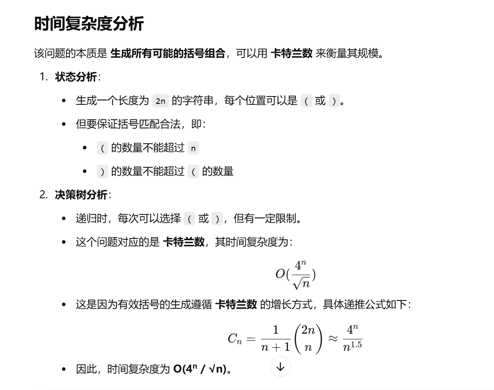
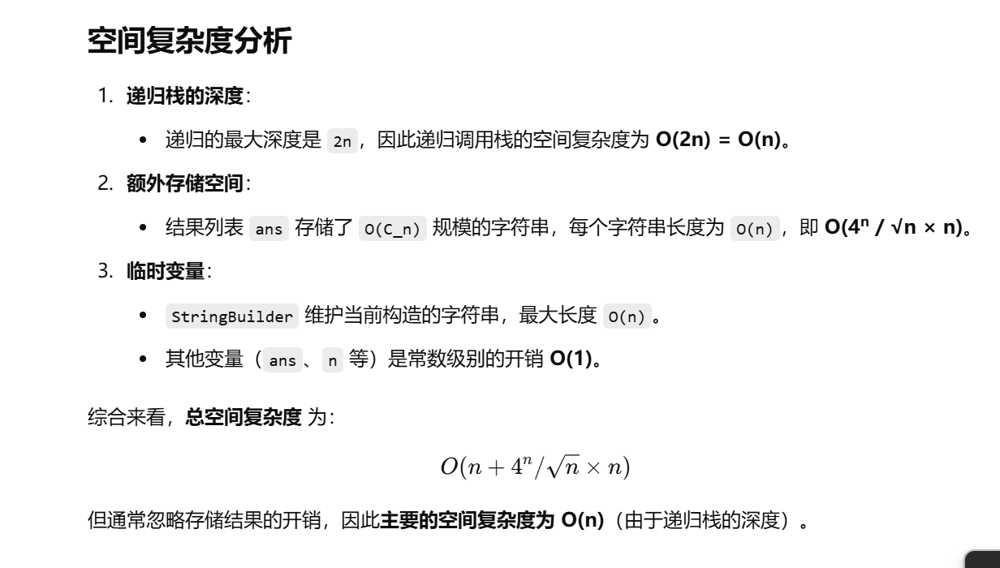

没做过


[22. 括号生成 - 力扣（LeetCode）](https://leetcode.cn/problems/generate-parentheses/description/?envType=study-plan-v2&envId=top-100-liked)


# 自己想的做法


```java
import java.util.ArrayList;
import java.util.List;

class Solution {
    List<String> ans;  // 存储所有符合条件的括号组合
    int n;  // 需要生成的括号对数
    StringBuilder sb;  // 用于构建当前递归路径上的括号字符串

    public List<String> generateParenthesis(int n) {
        ans = new ArrayList<>();  // 初始化存储结果的列表
        sb = new StringBuilder(); // 初始化用于构建括号组合的 StringBuilder
        this.n = n;  // 赋值 n
        dfs(0, 0, 0);  // 开始深度优先搜索 (DFS)，初始深度为 0，左右括号数都为 0
        return ans;  // 返回最终的结果列表
    }

    /**
     * 深度优先搜索 (DFS) 生成所有可能的括号组合
     * @param depth 当前递归的深度，相当于已经放置的括号总数
     * @param leftCount 当前使用的左括号数量
     * @param rightCount 当前使用的右括号数量
     */
    public void dfs(int depth, int leftCount, int rightCount) {
        // 剪枝条件：
        // 1. 左括号或右括号数量超过 n，直接返回
        // 2. 右括号数量不能大于左括号数量，否则括号顺序不合法
        if (leftCount > n || rightCount > n || rightCount > leftCount) {
            return;
        }

        // 递归终止条件：
        // 如果当前深度等于 2 * n（即括号数量达到要求），将构造的括号组合加入结果集
        if (depth == 2 * n) {
            ans.add(sb.toString()); // 将当前字符串加入结果列表
            return;
        }

        // 选择分支：如果当前左括号数为 0，只能放置左括号
        if (leftCount == 0) {
            sb.append("(");  // 添加左括号
            dfs(depth + 1, leftCount + 1, rightCount);  // 递归调用，增加左括号计数
            sb.deleteCharAt(sb.length() - 1);  // 回溯，撤销上一步操作
        } 
        // 选择分支：如果左括号数已经等于 n，只能放置右括号
        else if (leftCount == n) {
            sb.append(")");  // 添加右括号
            dfs(depth + 1, leftCount, rightCount + 1);  // 递归调用，增加右括号计数
            sb.deleteCharAt(sb.length() - 1);  // 回溯，撤销上一步操作
        } 
        // 选择分支：否则，可以选择放置左括号或右括号
        else {
            sb.append("(");  // 选择放置左括号
            dfs(depth + 1, leftCount + 1, rightCount);  // 递归调用
            sb.deleteCharAt(sb.length() - 1);  // 回溯，撤销上一步操作

            sb.append(")");  // 选择放置右括号
            dfs(depth + 1, leftCount, rightCount + 1);  // 递归调用
            sb.deleteCharAt(sb.length() - 1);  // 回溯，撤销上一步操作
        }
    }
}

```





