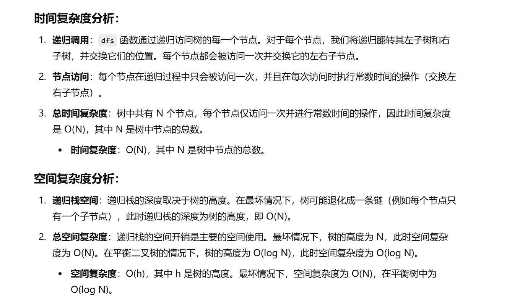

做过


[226. 翻转二叉树 - 力扣（LeetCode）](https://leetcode.cn/problems/invert-binary-tree/description/?envType=study-plan-v2&envId=top-100-liked)


灵神题解：[226. 翻转二叉树 - 力扣（LeetCode）](https://leetcode.cn/problems/invert-binary-tree/solutions/2713610/shi-pin-shen-ru-li-jie-di-gui-pythonjava-zhqh/?envType=study-plan-v2&envId=top-100-liked)


# 自己想的一种方法，和灵神其中一种一样


```java
class Solution {
    // 主函数，返回翻转后的树
    public TreeNode invertTree(TreeNode root) {
        // 调用 dfs 函数递归翻转树
        dfs(root);
        // 返回翻转后的树根节点
        return root;
    }

    // 深度优先搜索（DFS）递归函数，翻转树的每个节点的左右子树
    public void dfs(TreeNode root) {
        // 如果当前节点为空，直接返回
        if (root == null) {
            return;
        }
        
        // 交换当前节点的左右子节点
        TreeNode left = root.left;  // 临时存储左子节点
        TreeNode right = root.right; // 临时存储右子节点
        root.left = right;  // 将右子节点赋给左子节点
        root.right = left;  // 将左子节点赋给右子节点
        
        // 递归翻转左子树
        dfs(root.left);
        // 递归翻转右子树
        dfs(root.right);
    }
}

```


# 灵神另一种做法


```java
class Solution {
    // 主函数，返回翻转后的树
    public TreeNode invertTree(TreeNode root) {
        // 调用 dfs 函数递归翻转树
        return dfs(root);
    }

    // 深度优先搜索（DFS）递归函数，翻转树的每个节点的左右子树
    public TreeNode dfs(TreeNode root) {
        // 如果当前节点为空，返回 null
        if (root == null) {
            return null;
        }
        
        // 递归翻转左子树并存储返回结果
        TreeNode left = dfs(root.left);
        // 递归翻转右子树并存储返回结果
        TreeNode right = dfs(root.right);
        
        // 交换当前节点的左右子树
        root.left = right;  // 当前节点的左子节点设为翻转后的右子树
        root.right = left;  // 当前节点的右子节点设为翻转后的左子树
        
        // 返回当前节点（经过左右子树翻转后的新树结构）
        return root;
    }
}

```


