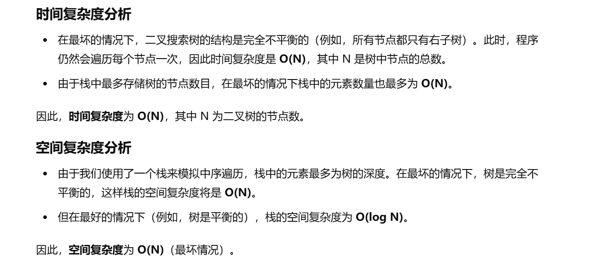
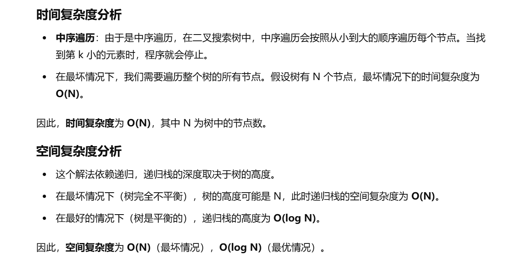

没做过


[230. 二叉搜索树中第 K 小的元素 - 力扣（LeetCode）](https://leetcode.cn/problems/kth-smallest-element-in-a-bst/description/?envType=study-plan-v2&envId=top-100-liked)


我一直在想中序遍历，然后统计次数，第k个数就是最小的数，但是我想不出来这个dfs咋写，包括统计次数怎么统计


# 这里可以用中序遍历的迭代写法


参考[94. 二叉树的中序遍历 - 力扣（LeetCode）](https://leetcode.cn/problems/binary-tree-inorder-traversal/description/?envType=study-plan-v2&envId=top-100-liked)


```java
class Solution {

    // 定义一个方法，接受二叉搜索树的根节点 root 和一个整数 k，返回树中第 k 小的元素
    public int kthSmallest(TreeNode root, int k) {
        // 使用一个栈来模拟中序遍历
        Deque<TreeNode> stack = new LinkedList<>();

        // 当栈不为空或者当前节点不是 null 时，继续遍历
        while (root != null || !stack.isEmpty()) {

            // 先一直遍历到左子树的最左边
            while (root != null) {
                // 将当前节点压入栈
                stack.push(root);
                // 遍历左子树
                root = root.left;
            }

            // 弹出栈顶节点，表示访问当前节点
            root = stack.pop();
            // 每次访问一个节点，减少 k 的值
            k--;
            // 如果 k 为 0，说明当前节点就是我们要找的第 k 小的元素
            if (k == 0) {
                return root.val;
            }

            // 如果当前节点有右子树，转到右子树
            root = root.right;
        }

        // 如果没找到返回 -1（理论上不会到这一步）
        return -1;
    }
}

```





# 递归写法


```java
class Solution {

    // 用来记录第 k 小元素的计数器
    int count;
    // 用来存储最终的第 k 小元素的值
    int ans = 0;

    // kthSmallest 方法：接收二叉搜索树的根节点 root 和整数 k，返回第 k 小的元素
    public int kthSmallest(TreeNode root, int k) {
        // 初始化 count 为 k，表示我们要找到第 k 小的元素
        count = k;
        // 执行深度优先搜索
        dfs(root);
        // 返回找到的第 k 小的元素
        return ans;
    }

    // dfs 方法：递归进行中序遍历
    public void dfs(TreeNode root) {
        // 如果当前节点为空，直接返回
        if (root == null) {
            return;
        }
        
        // 先遍历左子树
        if (count > 0) {
            dfs(root.left);
        }

        // 访问当前节点，减少 count
        count--;
        
        // 如果 count 为 0，说明当前节点就是第 k 小的元素，记录答案
        if (count == 0) {
            ans = root.val;
            return;
        }

        // 如果 count 大于 0，继续遍历右子树
        if (count > 0) {
            dfs(root.right);
        }
    }
}

```



