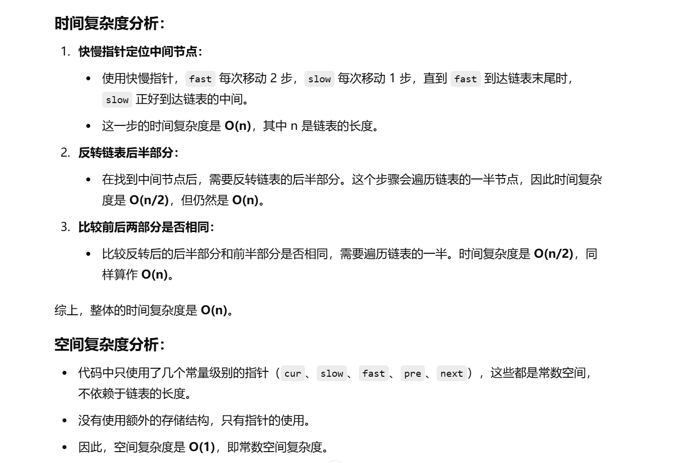

之前做过


[234. 回文链表 - 力扣（LeetCode）](https://leetcode.cn/problems/palindrome-linked-list/description/?envType=study-plan-v2&envId=top-100-liked)


# 自己想的一种解法


**和灵神想法一样，就是有个地方有区别，一会说明**


灵神题解：[234. 回文链表 - 力扣（LeetCode）](https://leetcode.cn/problems/palindrome-linked-list/submissions/601322446/?envType=study-plan-v2&envId=top-100-liked)


```java
class Solution {
    public boolean isPalindrome(ListNode head) {
        // 1. 使用 cur 来遍历链表，计算链表的大小
        ListNode cur = head;
        int size = 0;
        while (cur != null) {
            cur = cur.next; // 向链表的下一个节点移动
            size++; // 每访问一个节点，链表的大小增加 1
        }

        // 2. 将 cur 重新指向头节点
        cur = head;
        // 3. 将 cur 移动到链表的中间位置
        for (int i = 0; i < size / 2; i++) {
            cur = cur.next; // 将 cur 移动到链表的中间
        }

        // 4. 反转后半部分的链表
        ListNode pre = null;  // pre 初始化为 null, 用于反转链表
        ListNode next = null; // next 用来保存 cur 的下一个节点
        while (cur != null) {
            next = cur.next;  // 暂存 cur 的下一个节点
            cur.next = pre;   // 将 cur 节点指向 pre，反转链接
            pre = cur;        // 更新 pre 为当前节点
            cur = next;       // cur 向后移动
        }

        // 5. 比较链表前半部分和反转后的后半部分是否相同
        while (pre != null) {
            if (pre.val != head.val) {  // 如果反转后的后半部分和前半部分不相同，则返回 false
                return false;
            }
            pre = pre.next;  // 向后移动 pre
            head = head.next; // 向后移动 head
        }

        return true;  // 如果两部分完全匹配，返回 true
    }
}

```


**和灵神的区别，在找中间节点时，灵神直接用的快慢指针，我遍历了一遍，用得到的size的一半找的，所以灵神做法更好更快。**


# 灵神解法


```java
class Solution {
    public boolean isPalindrome(ListNode head) {
        ListNode cur = head;

        // 1. 使用快慢指针方法找到链表的中间节点
        ListNode slow = head;  // slow指针从头开始，每次移动1步
        ListNode fast = head;  // fast指针从头开始，每次移动2步
        while (fast != null && fast.next != null) {
            slow = slow.next;     // slow每次走1步
            fast = fast.next.next; // fast每次走2步
        }

        // 2. 反转链表的后半部分
        cur = slow;  // 将 cur 指向链表的中间位置，即慢指针指向的节点
        ListNode pre = null;  // 用来反转链表的前一节点
        ListNode next = null; // 用来存储 cur 的下一个节点
        while (cur != null) {
            next = cur.next;  // 暂存 cur 的下一个节点
            cur.next = pre;   // 将 cur 的 next 指向前一个节点，实现反转
            pre = cur;        // 更新 pre 为当前节点
            cur = next;       // cur 移动到下一个节点
        }

        // 3. 比较反转后的后半部分和前半部分是否相同
        while (pre != null) {
            if (pre.val != head.val) {  // 如果反转后的链表和前半部分不相同，返回 false
                return false;
            }
            pre = pre.next;  // pre 向后移动
            head = head.next; // head 向后移动
        }

        return true;  // 如果完全匹配，返回 true
    }
}

```

