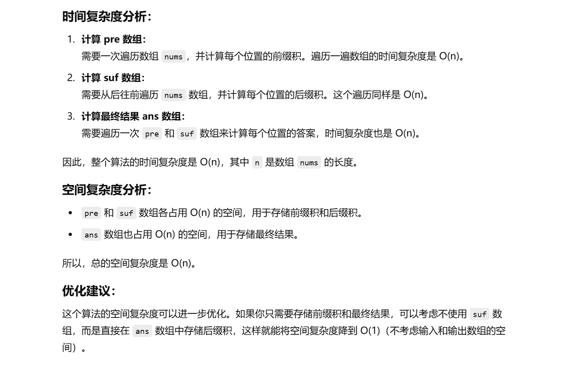
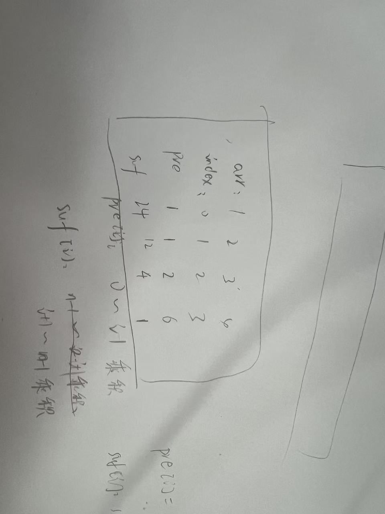

这个题目之前做没做过


知识点：前后缀乘积


[238. 除自身以外数组的乘积 - 力扣（LeetCode）](https://leetcode.cn/problems/product-of-array-except-self/description/?envType=study-plan-v2&envId=top-100-liked)


没做出来，没思路


题解：[238. 除自身以外数组的乘积 - 力扣（LeetCode）](https://leetcode.cn/problems/product-of-array-except-self/solutions/2783788/qian-hou-zhui-fen-jie-fu-ti-dan-pythonja-86r1/?envType=study-plan-v2&envId=top-100-liked)


# 利用前后缀乘积表来计算


```java
class Solution {
    public int[] productExceptSelf(int[] nums) {
        // 获取数组的长度
        int n = nums.length;

        // 初始化两个辅助数组：pre 和 suf，分别存储前缀积和后缀积
        int[] pre = new int[n];
        int[] suf = new int[n];
        
        // pre[0] 设置为 1，因为左侧没有元素
        pre[0] = 1;
        
        // suf[n-1] 设置为 1，因为右侧没有元素
        suf[n - 1] = 1;
        
        // 计算 pre 数组，其中 pre[i] 存储从索引 0 到 i-1 位置的所有元素的乘积
        // pre[0] 已经初始化为 1，从 pre[1] 开始计算
        for (int i = 1; i < n; i++) {
            pre[i] = pre[i - 1] * nums[i - 1];  // pre[i] = nums[0] * nums[1] * ... * nums[i-1]
        }

        // 计算 suf 数组，其中 suf[i] 存储从索引 i+1 到 n-1 位置的所有元素的乘积
        // suf[n-1] 已经初始化为 1，从 suf[n-2] 开始计算
        for (int i = n - 2; i >= 0; i--) {
            suf[i] = suf[i + 1] * nums[i + 1];  // suf[i] = nums[i+1] * nums[i+2] * ... * nums[n-1]
        }

        // 初始化结果数组 ans 用于存储答案
        int[] ans = new int[n];
        
        // 将 pre 和 suf 中的值相乘，存入 ans 数组中
        // ans[i] = pre[i] * suf[i]
        for (int i = 0; i < n; i++) {
            ans[i] = pre[i] * suf[i];  // 结果是 nums 数组中除了 nums[i] 之外的所有元素的乘积
        }
        
        // 返回结果数组
        return ans;
    }
}

```







**看上图中的举例也可以结合理解一下优化空间复杂度的算法**


# 优化空间复杂度的算法


```java
class Solution {
    public int[] productExceptSelf(int[] nums) {
        // 获取数组的长度
        int n = nums.length;

        // 初始化结果数组 ans，存储最终结果
        int[] ans = new int[n];
        
        // 初始化 ans[0] 为 1，表示左侧没有元素的乘积
        ans[0] = 1;

        // 计算每个元素的前缀积，并存储到 ans 数组中
        // 这里 ans 数组暂时存储的是前缀积
        for (int i = 1; i < n; i++) {
            ans[i] = ans[i - 1] * nums[i - 1];  // ans[i] = nums[0] * nums[1] * ... * nums[i-1]
        }

        // 临时变量 suffix，用来存储右侧的乘积
        int suffix = 1;
        
        // 从右到左遍历数组，更新 ans 数组中的值
        // 这里直接利用 ans 数组存储前缀积和后缀积的乘积
        for (int i = n - 1; i >= 0; i--) {
            ans[i] = ans[i] * suffix;  // ans[i] = pre[i] * suf[i]
            suffix *= nums[i];  // 更新 suffix 变量，用于计算右侧的乘积
        }

        // 返回最终的结果数组
        return ans;
    }
}

```

