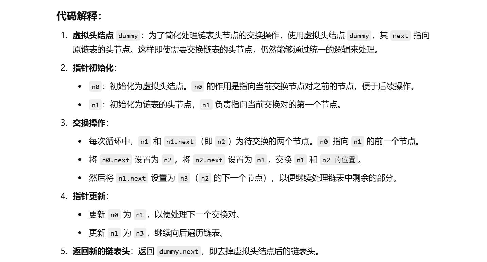
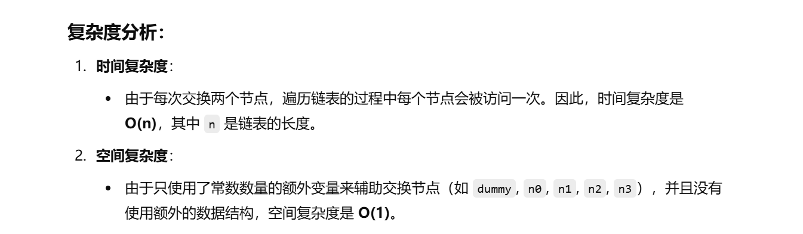

做过


[24. 两两交换链表中的节点 - 力扣（LeetCode）](https://leetcode.cn/problems/swap-nodes-in-pairs/description/?envType=study-plan-v2&envId=top-100-liked)


没做出来


灵神讲解：[24. 两两交换链表中的节点 - 力扣（LeetCode）](https://leetcode.cn/problems/swap-nodes-in-pairs/solutions/2374872/tu-jie-die-dai-di-gui-yi-zhang-tu-miao-d-51ap/?envType=study-plan-v2&envId=top-100-liked)


```java
class Solution {
    public ListNode swapPairs(ListNode head) {
        // 创建一个虚拟头结点，方便处理链表头部的节点交换
        ListNode dummy = new ListNode(-1, head);
        // n0 初始化为虚拟头结点，n1 初始化为链表的头结点
        ListNode n0 = dummy;
        ListNode n1 = head;

        // 遍历链表，每次交换两个相邻节点
        while (n1 != null && n1.next != null) {
            // n2 表示 n1 的下一个节点，n3 表示 n2 的下一个节点
            ListNode n2 = n1.next;
            ListNode n3 = n2.next;

            // 将 n0 的 next 指向 n2，即将 n2 放到前面
            n0.next = n2;
            // 将 n2 的 next 指向 n1，即交换 n1 和 n2 的位置
            n2.next = n1;
            // 将 n1 的 next 指向 n3，继续处理后续节点
            n1.next = n3;

            // 更新 n0 和 n1 的位置，准备处理下一个节点对
            n0 = n1;
            n1 = n3;
        }

        // 返回虚拟头结点的 next，即新的链表头
        return dummy.next;
    }
}

```





