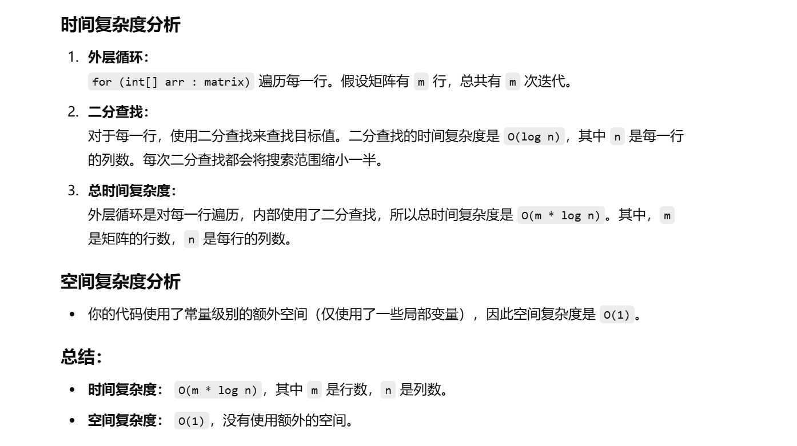

没做过这道题目


没做出来


知识点：官解是二分法，灵神感觉像是脑筋急转弯


[240. 搜索二维矩阵 II - 力扣（LeetCode）](https://leetcode.cn/problems/search-a-2d-matrix-ii/description/?envType=study-plan-v2&envId=top-100-liked)


# 灵神做法

：[240. 搜索二维矩阵 II - 力扣（LeetCode）](https://leetcode.cn/problems/search-a-2d-matrix-ii/solutions/2783938/tu-jie-pai-chu-fa-yi-tu-miao-dong-python-kytg/?envType=study-plan-v2&envId=top-100-liked)


```java
class Solution {
    // 这是一个用于在二维矩阵中查找目标值的函数
    // matrix 是一个二维矩阵，其中每行是升序排列的，每列也是升序排列的
    // target 是我们需要查找的目标值
    public boolean searchMatrix(int[][] matrix, int target) {
        int m = matrix.length;  // 获取矩阵的行数
        int n = matrix[0].length;  // 获取矩阵的列数
        int i = 0, j = n - 1;  // 初始化两个指针，i从矩阵的第一行开始，j从矩阵的最后一列开始

        // 当行数和列数都有效时继续查找
        while (i < m && j >= 0) {
            // 如果当前元素等于目标值，返回 true
            if (matrix[i][j] == target) {
                return true;
            }
            // 如果当前元素小于目标值，说明目标值可能在下方的行中
            if (matrix[i][j] < target) {
                i++;  // 只向下移动一行
            } else {
                j--;  // 向左移动一列
            }
        }
        // 如果遍历完所有可能的元素后没有找到目标值，返回 false
        return false;
    }
}

```


# 二分法


```java
class Solution {
    // 目标是检查矩阵中是否存在目标值
    public boolean searchMatrix(int[][] matrix, int target) {
        // 获取矩阵的行数 m 和列数 n
        int m = matrix.length;
        int n = matrix[0].length;
        
        // 对每一行利用二分法进行查找
        for (int[] arr : matrix) {
            // 如果当前行的最后一个元素小于目标值，则跳过此行
            if (arr[n - 1] < target) {
                continue;
            }

            // 如果当前行的最后一个元素等于目标值，直接返回 true
            if (arr[n - 1] == target) {
                return true;
            }

            // 初始化二分查找的左右边界（左闭右开）
            int l = 0;
            int r = n;  // 注意：此处右边界应为 n 而不是 n - 1

            // 开始二分查找
            while (l < r) {
                // 计算中间索引
                int mid = (r - l) / 2 + l;

                // 如果当前元素大于目标值，则目标值只能在左半部分
                if (arr[mid] > target) {
                    r = mid;  // 更新右边界
                }
                // 如果当前元素小于目标值，则目标值只能在右半部分
                else if (arr[mid] < target) {
                    l = mid + 1;  // 更新左边界
                }
                // 如果当前元素等于目标值，则找到目标，直接返回 true
                else {
                    return true;
                }
            }
        }

        // 如果遍历完所有行都没有找到目标值，返回 false
        return false;
    }
}

```



