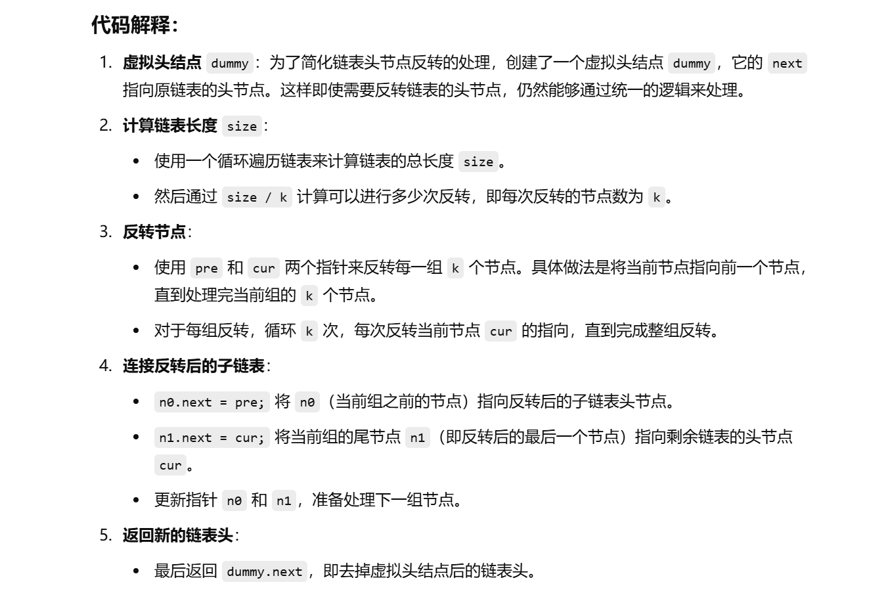
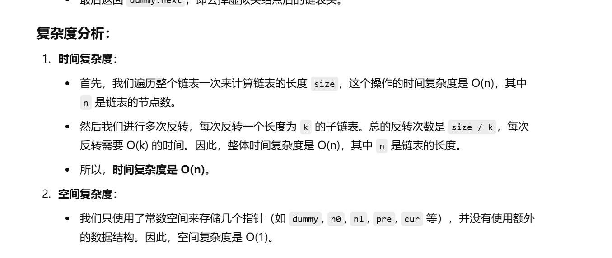

做过


[25. K 个一组翻转链表 - 力扣（LeetCode）](https://leetcode.cn/problems/reverse-nodes-in-k-group/description/?envType=study-plan-v2&envId=top-100-liked)


自己想的方法，通过画图模拟过程出来的


```java
class Solution {
    public ListNode reverseKGroup(ListNode head, int k) {
        // 创建一个虚拟头结点，方便处理头节点的反转
        ListNode dummy = new ListNode(-1, head);

        int size = 0;
        ListNode n0 = dummy;
        ListNode n1 = head;
        ListNode pre = null;
        ListNode cur = n1;

        // 计算链表的总长度
        while (cur != null) {
            size++;
            cur = cur.next;
        }

        // 计算可以进行多少次k个节点的反转
        int count = size / k;
        cur = head;

        // 开始处理每一组k个节点的反转
        while (count > 0) {
            // 对当前k个节点进行反转
            for (int i = 0; i < k; i++) {
                ListNode next = cur.next;  // 记录当前节点的下一个节点
                cur.next = pre;            // 将当前节点指向前一个节点
                pre = cur;                 // 更新pre为当前节点
                cur = next;                // 更新cur为下一个节点
            }

            // 连接反转后的子链表
            n0.next = pre;  // 将n0的next指向反转后的子链表的头
            n1.next = cur;  // 将反转后的子链表的尾节点（n1）指向剩余链表

            // 更新n0和n1，准备处理下一个k个节点
            n0 = n1;
            n1 = cur;
            pre = null;  // 重新设置pre为null，准备反转下一组
            count--;     // 处理完一组后减少反转次数
        }

        // 返回去掉虚拟头结点后的链表头
        return dummy.next;
    }
}

```







