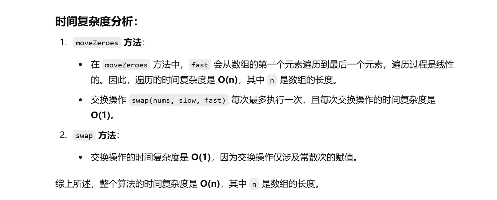

[283. 移动零 - 力扣（LeetCode）](https://leetcode.cn/problems/move-zeroes/description/?envType=study-plan-v2&envId=top-100-liked)

这个题目之前做过


知识点：双指针


没做出来


之前做的在 [283.移动零.md](..\入门算法题目\数组\283.移动零.md) 这


```java
class Solution {
    // moveZeroes 方法，用来将数组中的零移动到数组的末尾，非零元素保持原顺序
    public void moveZeroes(int[] nums) {
        // slow 和 fast 指针初始化
        int slow = 0, fast = 0;
        
        // 遍历数组直到 fast 指针越过数组的末尾
        while (fast < nums.length) {
            // 如果 fast 指向的元素不是零，则需要交换
            if (nums[fast] != 0) {
                // 交换 slow 和 fast 指向的元素，使非零元素被放置到数组前面
                swap(nums, slow, fast);
                // slow 指针向前移动，准备放置下一个非零元素
                slow++;
            }
            // fast 指针继续向前移动，检查下一个元素
            fast++;
        }
    }

    // swap 方法，用于交换数组中指定位置的两个元素
    public void swap(int[] nums, int i, int j) {
        // 使用临时变量进行交换
        int temp = nums[i];
        nums[i] = nums[j];
        nums[j] = temp;
    }
}

```



