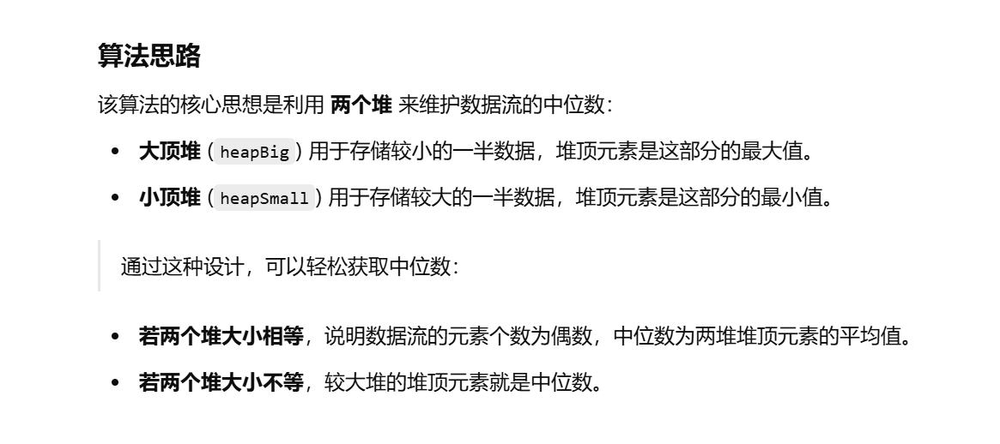
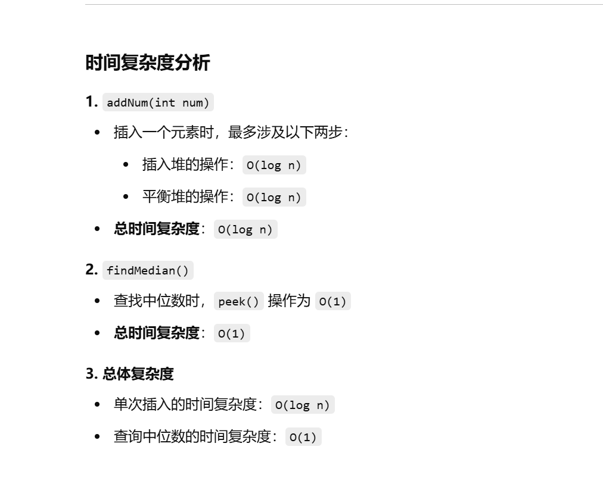

做过


知识点：数据结构的设计，堆


[295. 数据流的中位数 - 力扣（LeetCode）](https://leetcode.cn/problems/find-median-from-data-stream/?envType=study-plan-v2&envId=top-100-liked)


[算法讲解035【必备】数据结构设计高频题_哔哩哔哩_bilibili](https://www.bilibili.com/video/BV1nF411y7rD/?spm_id_from=333.1387.search.video_card.click&vd_source=96c1635797a0d7626fb60e973a29da38)


没看之前的题解，目前想的就是用两个堆，一个大顶堆，一个小顶堆

大顶堆放较小的数，小顶堆放较大的数


思路是对的，但是具体实现过程不会做


```java
import java.util.PriorityQueue;

class MedianFinder {
    // 大顶堆（存储较小的一半数据，堆顶是最大值）
    PriorityQueue<Integer> heapBig;
    // 小顶堆（存储较大的一半数据，堆顶是最小值）
    PriorityQueue<Integer> heapSmall;

    // 构造方法，初始化两个堆
    public MedianFinder() {
        // 大顶堆：通过 (b - a) 实现降序排列
        heapBig = new PriorityQueue<>((a, b) -> b - a); 
        // 小顶堆：通过 (a - b) 实现升序排列
        heapSmall = new PriorityQueue<>((a, b) -> a - b);
    }

    // 添加一个数到数据流中
    public void addNum(int num) {
        // 将数字插入到合适的堆中
        insert(num);  
        // 调整两个堆的平衡性
        modify();     
    }

    // 查找当前数据流的中位数
    public double findMedian() {
        // 如果两个堆的大小相等，说明数据流元素总数为偶数
        if (heapBig.size() == heapSmall.size()) {
            // 取两个堆的堆顶元素，计算平均值
            return (heapBig.peek() + heapSmall.peek()) / 2.0;
        } else {
            // 如果堆的大小不相等，较大堆的堆顶元素就是中位数
            if (heapBig.size() > heapSmall.size()) {
                return heapBig.peek();
            } else {
                return heapSmall.peek();
            }
        }
    }

    // 插入元素的逻辑
    public void insert(int num) {
        // 如果大顶堆为空，直接加入大顶堆
        if (heapBig.isEmpty()) {
            heapBig.offer(num);
        } else {
            // 若 `num` 小于等于大顶堆的堆顶元素，放入大顶堆
            if (num <= heapBig.peek()) {
                heapBig.offer(num);
            } 
            // 若 `num` 大于大顶堆的堆顶元素，放入小顶堆
            else {
                heapSmall.offer(num);
            }
        }
    }

    // 平衡两个堆的元素个数，保证两个堆的大小差不超过 1
    public void modify() {
        // 若两个堆的元素个数差值大于等于 2，则进行平衡
        if (Math.abs(heapBig.size() - heapSmall.size()) >= 2) {
            // 若大顶堆元素个数较多，将其堆顶元素转移到小顶堆
            if (heapBig.size() > heapSmall.size()) {
                heapSmall.offer(heapBig.poll());
            } 
            // 若小顶堆元素个数较多，将其堆顶元素转移到大顶堆
            else {
                heapBig.offer(heapSmall.poll());
            }
        }
    }
}

```





