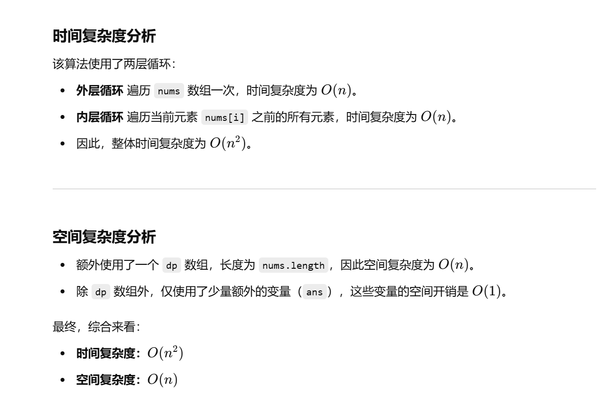

做过


[300. 最长递增子序列 - 力扣（LeetCode）](https://leetcode.cn/problems/longest-increasing-subsequence/description/?envType=study-plan-v2&envId=top-100-liked)


不会做了


# 普通dp做法

```java
import java.util.Arrays;

class Solution {
    public int lengthOfLIS(int[] nums) {
        if (nums.length == 1) { // 如果数组长度为 1，最长递增子序列的长度必然为 1
            return 1;
        }

        // dp[i] 表示以下标 i 结尾的最长递增子序列的长度
        int[] dp = new int[nums.length];

        // 初始化 dp 数组，每个元素默认最小长度为 1（自身单独一个数）
        Arrays.fill(dp, 1);

        // 记录整个数组中的最长递增子序列的最大长度
        int ans = Integer.MIN_VALUE;

        // 遍历数组中的每个元素，从索引 1 开始
        for (int i = 1; i < nums.length; i++) {
            // 在 i 之前的所有元素中找到比 nums[i] 小的 nums[j]
            for (int j = 0; j < i; j++) {
                if (nums[i] > nums[j]) { // 确保是递增的情况
                    // 更新 dp[i]，取当前值和 dp[j] + 1 的最大值
                    dp[i] = Math.max(dp[i], dp[j] + 1);
                }
            }
            // 更新全局最长子序列的长度
            ans = Math.max(ans, dp[i]);
        }

        return ans;
    }
}

```





# 二分查找+贪心优化


```

```

