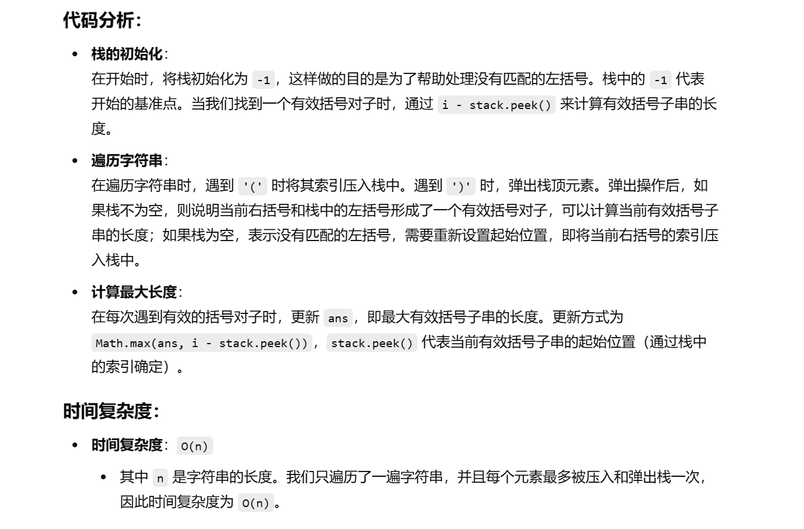
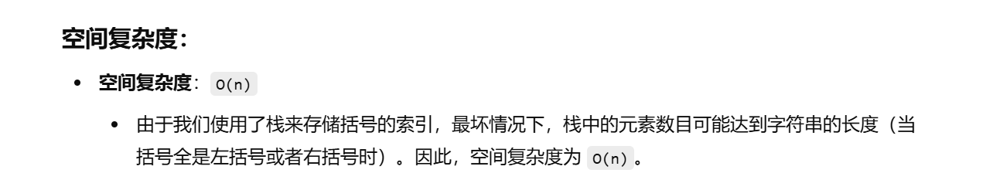

没做过


[32. 最长有效括号 - 力扣（LeetCode）](https://leetcode.cn/problems/longest-valid-parentheses/?envType=study-plan-v2&envId=top-100-liked)


不会做


# 栈


```java
class Solution {
    public int longestValidParentheses(String s) {
        // 初始化栈，栈顶元素为-1，用于处理特殊情况
        Deque<Integer> stack = new ArrayDeque<>();
        stack.push(-1);  // 用于处理没有匹配的左括号，作为起始标记
        int ans = 0;  // 记录最大有效括号子串的长度

        // 遍历字符串中的每个字符
        for (int i = 0; i < s.length(); i++) {
            // 如果是左括号 '(', 压入当前的索引
            if (s.charAt(i) == '(') {
                stack.push(i);  // 将 '(' 的索引入栈
            } else {
                // 如果是右括号 ')', 弹出栈顶元素
                stack.pop();
                
                // 栈不为空，说明当前右括号和一个左括号匹配
                if (!stack.isEmpty()) {
                    // 计算当前有效括号子串的长度，并更新最大长度
                    ans = Math.max(ans, i - stack.peek());  // 当前索引 i 减去栈顶索引，即为有效括号长度
                } else {
                    // 如果栈为空，说明没有匹配的左括号，将当前索引入栈
                    stack.push(i);  // 重新设置起始点
                }
            }
        }
        
        return ans;  // 返回最大有效括号子

```


`stack.push(-1);` 这一行的作用是初始化栈，使其在开始时包含一个特殊的值 `-1`。这个特殊值 `-1` 是为了处理一些边界情况，特别是在计算有效括号子串的长度时，它充当了一个起始位置的标记。

### 为什么需要 `stack.push(-1);`？

1. **处理第一个有效括号子串的情况**： 当我们找到一个有效括号对子时（例如 `()`），栈顶索引会被弹出，但如果栈是空的，我们就无法计算出该有效括号对子所对应的长度。因此，通过在栈中先放入 `-1`，它可以作为一个虚拟的“起始点”，即第一个有效括号子串之前的“位置”。

   例如，对于字符串 `()`：

   - 当遇到第一个 `'('`，我们把索引 `0` 压入栈中：`stack = [-1, 0]`。
   - 当遇到 `')'` 时，栈顶元素（`0`）被弹出，剩下 `-1`，此时 `i - stack.peek()` 就会得到有效括号对子长度 `1 - (-1) = 2`。

2. **处理栈为空的情况**： 当我们遇到一个没有匹配的右括号 `')'` 时（例如在 `())` 这种字符串中），栈会变空。如果栈为空，说明我们没有找到匹配的左括号，此时应该重新设置一个新的起点。在这种情况下，我们将当前的索引压入栈中，以作为新的起点。

   - 例如，字符串 `())` 中，当遇到第二个 `')'` 时，栈会变空，因此我们将当前的索引 `2` 压入栈中，作为新的起始位置。

### 如果不加 `stack.push(-1);` 会怎样？

如果不加 `stack.push(-1);`，那么在处理边界情况时可能会出现错误。具体来说：

- 在计算有效括号子串长度时，如果栈为空，无法通过栈来确定子串的起始位置，导致无法正确计算长度。
- 如果字符串的第一个括号是有效括号对（例如 `"()"`），那么没有 `-1` 作为起始点，我们将无法正确计算出括号对的长度。




