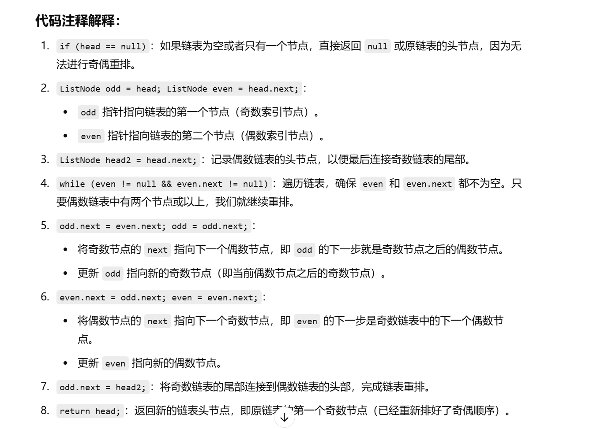
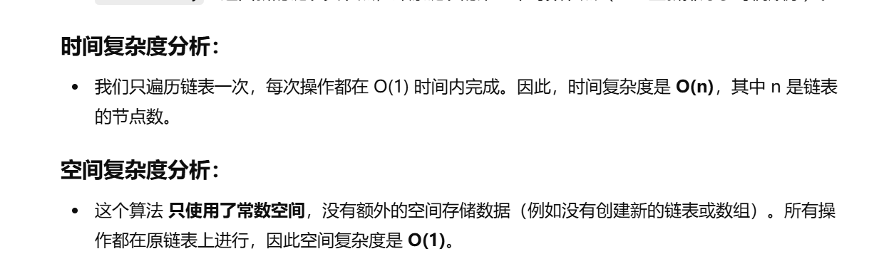

没做过


[328. 奇偶链表 - 力扣（LeetCode）](https://leetcode.cn/problems/odd-even-linked-list/description/)


```java
class Solution {
    public ListNode oddEvenList(ListNode head) {
        // 如果链表为空或者只有一个节点，直接返回头节点
        if (head == null) {
            return null;
        }
        
        // odd 用于指向奇数索引的节点，初始化指向链表的第一个节点
        ListNode odd = head;
        // even 用于指向偶数索引的节点，初始化指向链表的第二个节点
        ListNode even = head.next;
        // 保存偶数链表的头节点，用于最后连接奇偶链表
        ListNode head2 = head.next;
        
        // 遍历链表，直到偶数链表的末尾
        while (even != null && even.next != null) {
            // 将奇数节点（odd）指向下一个偶数节点（even.next）
            odd.next = even.next;
            // 更新 odd，指向下一个奇数节点
            odd = odd.next;
            
            // 将偶数节点（even）指向下一个奇数节点（odd.next）
            even.next = odd.next;
            // 更新 even，指向下一个偶数节点
            even = even.next;
        }
        
        // 将奇数链表的尾部连接到偶数链表的头部（即 head2）
        odd.next = head2;
        
        // 返回重新组合后的链表头节点
        return head;
    }
}

```






