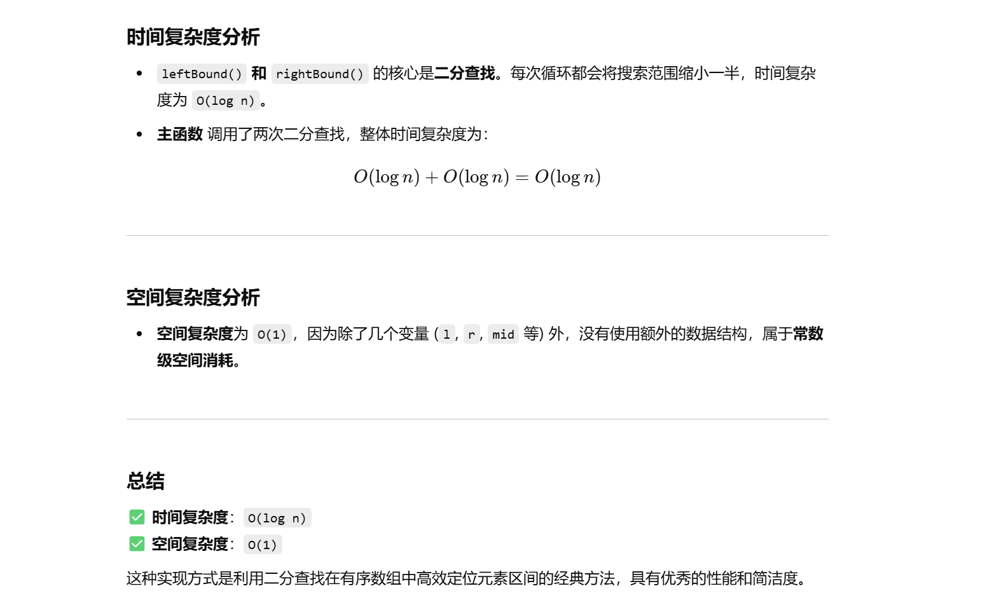

做过


知识点：二分查找


[34. 在排序数组中查找元素的第一个和最后一个位置 - 力扣（LeetCode）](https://leetcode.cn/problems/find-first-and-last-position-of-element-in-sorted-array/description/?envType=study-plan-v2&envId=top-100-liked)


[二分查找 红蓝染色法【基础算法精讲 04】_哔哩哔哩_bilibili](https://www.bilibili.com/video/BV1AP41137w7/?vd_source=96c1635797a0d7626fb60e973a29da38)


```java
class Solution {
    int m; // 数组长度，作为全局变量，减少传参

    // 主函数：搜索目标值的起始和结束位置
    public int[] searchRange(int[] nums, int target) {
        m = nums.length; // 初始化数组长度
        int left = leftBound(nums, target); // 找左边界
        int right = rightBound(nums, target); // 找右边界

        // 检查左边界是否越界，或者找到的元素是否不是目标值
        if (left == nums.length || nums[left] != target) {
            return new int[]{-1, -1}; // 若未找到目标值，返回[-1, -1]
        }

        // 返回找到的目标值区间
        return new int[]{left, right};
    }

    // 查找目标值的左边界
    public int leftBound(int[] nums, int target) {
        int l = 0, r = m; // 搜索区间 [l, r)
        while (l < r) { // 循环终止条件是 l == r
            int mid = (r - l) / 2 + l; // 计算中点，防止溢出
            if (nums[mid] >= target) {
                r = mid; // 收缩右边界，可能找到左边界
            } else {
                l = mid + 1; // 收缩左边界，跳过无效区间
            }
        }
        return l; // 返回左边界索引（或r也行，等价）
    }

    // 查找目标值的右边界
    public int rightBound(int[] nums, int target) {
        int l = 0, r = m; // 搜索区间 [l, r)
        while (l < r) { // 循环终止条件是 l == r
            int mid = (r - l) / 2 + l; // 计算中点，防止溢出
            if (nums[mid] <= target) {
                l = mid + 1; // 收缩左边界，可能找到右边界
            } else {
                r = mid; // 收缩右边界，跳过无效区间
            }
        }
        return l - 1; // 返回右边界索引（或r-1也行，等价）
    }
}

```



