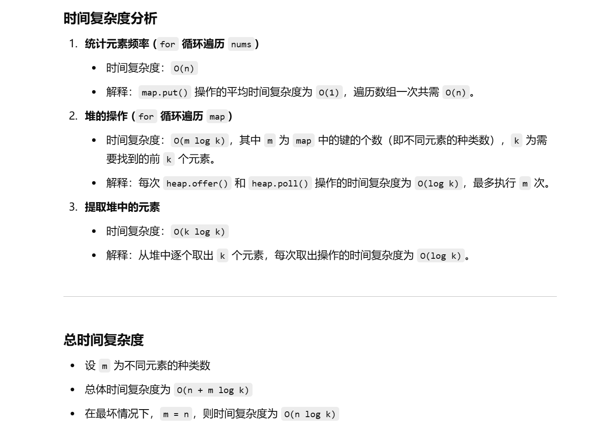

做过


[347. 前 K 个高频元素 - 力扣（LeetCode）](https://leetcode.cn/problems/top-k-frequent-elements/description/?envType=study-plan-v2&envId=top-100-liked)


```java
class Solution {
    public int[] topKFrequent(int[] nums, int k) {
        // 获取数组长度
        int n = nums.length;

        // 创建一个 HashMap，用于统计每个数字出现的频率
        Map<Integer, Integer> map = new HashMap<>();
        for (int i = 0; i < n; i++) {
            // 将元素及其出现次数存入 map，如果元素已存在，则在原有次数上加 1
            map.put(nums[i], map.getOrDefault(nums[i], 0) + 1);
        }

        // 创建一个小顶堆（优先队列），用于维护频率最高的 k 个元素
        PriorityQueue<int[]> heap = new PriorityQueue<>(new Comparator<int[]>() {
            @Override
            public int compare(int[] o1, int[] o2) {
                // 根据元素频率升序排序（小顶堆）
                return o1[1] - o2[1];
            }
        });

        // 遍历 map，将元素及其频率作为数组加入堆中
        for (Map.Entry<Integer, Integer> entry : map.entrySet()) {
            int key = entry.getKey();  // 数字
            int val = entry.getValue(); // 出现次数
            heap.offer(new int[]{key, val});  // 将元素及其频率加入堆
            if (heap.size() > k) {
                // 如果堆的大小超过 k，则移除堆顶元素（即频率最小的元素）
                heap.poll();
            }
        }

        // 提取堆中的元素，放入结果数组
        int[] ans = new int[k];
        for (int i = 0; i < k; i++) {
            ans[i] = heap.poll()[0];  // 取出堆顶元素的数字部分
        }

        return ans;
    }
}

```



