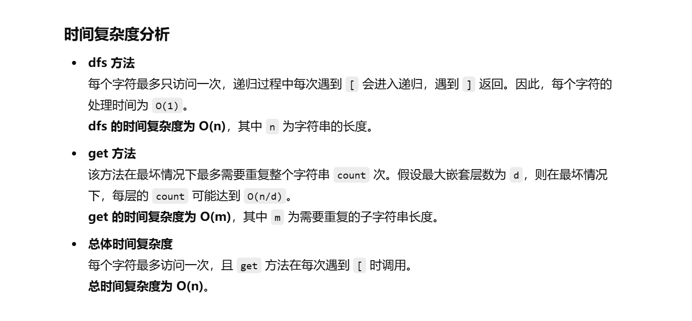

做过


[394. 字符串解码 - 力扣（LeetCode）](https://leetcode.cn/problems/decode-string/description/?envType=study-plan-v2&envId=top-100-liked)


不会做了


左神讲过这道题，我有印象


[算法讲解039【必备】嵌套类问题的递归解题套路_哔哩哔哩_bilibili](https://www.bilibili.com/video/BV1JP411p7KG/?spm_id_from=333.1387.upload.video_card.click&vd_source=96c1635797a0d7626fb60e973a29da38)


```java
class Solution {
    int where; // 记录当前解析到字符串的哪个位置

    // 主方法，接受一个编码字符串并返回解码后的结果
    public String decodeString(String s) {
        where = 0; // 初始化 `where` 为 0，表示起始位置
        return dfs(s.toCharArray(), 0); // 递归深度优先搜索
    }

    // 深度优先搜索 (DFS) 方法，用于解析字符串
    public String dfs(char[] s, int i) {
        StringBuilder sb = new StringBuilder(); // 用于存储解析出的结果
        int count = 0; // 记录当前的数字（用于重复次数）
        
        // 当 `i` 未越界，且当前位置不是 `]` 时持续解析
        while (i < s.length && s[i] != ']') {
            if (s[i] >= '0' && s[i] <= '9') {
                // 如果是数字，更新 `count`，以处理多位数字
                count = count * 10 + s[i] - '0';
                i++;
            } else if (s[i] >= 'a' && s[i] <= 'z') {
                // 如果是字母，直接加入结果
                sb.append(s[i]);
                i++;
            } else if (s[i] == '[') {
                // 遇到 `[` 时，进入递归解析内部的子字符串
                sb.append(get(count, dfs(s, i + 1))); // 递归调用 `dfs` 处理子字符串
                i = where + 1; // 更新 `i`，跳过已处理的子字符串部分
                count = 0; // 重置 `count`，避免干扰后续的计数
            }
        }
        
        // 到了字符串结尾或者遇到了']',更新where
        where = i;
        return sb.toString(); // 返回构建好的字符串
    }

    // 辅助方法，根据 `count` 复制字符串 `s`
    public String get(int count, String s) {
        StringBuilder sb = new StringBuilder();
        for (int i = 0; i < count; i++) {
            sb.append(s);
        }
        return sb.toString();
    }
}

```



