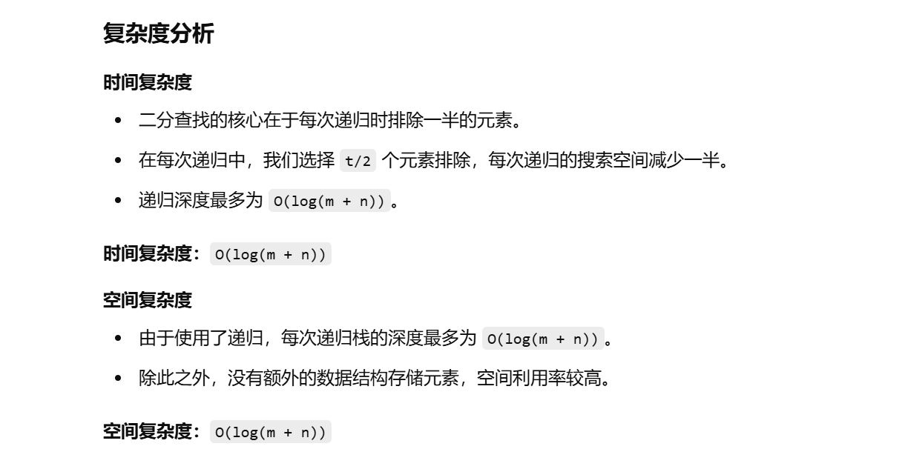

没做过


知识点：二分


[4. 寻找两个正序数组的中位数 - 力扣（LeetCode）](https://leetcode.cn/problems/median-of-two-sorted-arrays/description/?envType=study-plan-v2&envId=top-100-liked)


不会


要在 **O(log(m + n))** 的时间复杂度内找到两个有序数组的中位数，我们可以使用 **二分查找**。这个问题的核心在于：将两个数组划分成左右两部分，使得：

- **左部分的元素总数** = **右部分的元素总数**（或多一位）
- **左部分的最大值 ≤ 右部分的最小值**


我们可以将问题转化为寻找**较短数组的切割位置**，通过二分查找来确定该切割点。


# gpt做法，后面再看

```
    class Solution {
        public double findMedianSortedArrays(int[] nums1, int[] nums2) {
            // 确保 nums1 是较短的数组
            if (nums1.length > nums2.length) {
                return findMedianSortedArrays(nums2, nums1);
            }

            int m = nums1.length;
            int n = nums2.length;
            int left = 0, right = m;
            int midCount = (m + n + 1) / 2; // 保证左半部分元素个数大于右半部分

            while (left < right) {
                int i = left + (right - left) / 2;
                int j = midCount - i;

                // nums1[i] 太小，增大 i
                if (nums1[i] < nums2[j - 1]) {
                    left = i + 1;
                } else {
                    // nums1[i] 太大，减小 i
                    right = i;
                }
            }

            // 划分完成后，确定左侧最大值和右侧最小值
            int i = left;
            int j = midCount - i;

            int maxLeft = Math.max(
                    i == 0 ? Integer.MIN_VALUE : nums1[i - 1],
                    j == 0 ? Integer.MIN_VALUE : nums2[j - 1]
            );

            // 奇数情况，直接返回左侧最大值
            if ((m + n) % 2 == 1) {
                return maxLeft;
            }

            int minRight = Math.min(
                    i == m ? Integer.MAX_VALUE : nums1[i],
                    j == n ? Integer.MAX_VALUE : nums2[j]
            );

            // 偶数情况，返回两个中间值的平均值
            return (maxLeft + minRight) / 2.0;
        }
    }
```


# gpt另一种做法

```java
class Solution {
    public double findMedianSortedArrays(int[] nums1, int[] nums2) {
        int m = nums1.length;
        int n = nums2.length;

        // 初始判断，处理其中一个数组为空的情况
        if (m == 0) {
            return n % 2 == 0 ? (nums2[n / 2] + nums2[(n / 2) - 1]) / 2.0 : nums2[n / 2];
        }
        if (n == 0) {
            return m % 2 == 0 ? (nums1[m / 2] + nums1[(m / 2) - 1]) / 2.0 : nums1[m / 2];
        }

        // 找到第 k 小的数
        if ((m + n) % 2 == 1) {
            return find(nums1, 0, m - 1, nums2, 0, n - 1, (m + n + 1) / 2);
        } else {
            int k = (m + n) / 2;
            return (find(nums1, 0, m - 1, nums2, 0, n - 1, k) +
                    find(nums1, 0, m - 1, nums2, 0, n - 1, k + 1)) / 2.0;
        }
    }

    // 找到 nums1 和 nums2 指定范围内的第 t 小的数
    private int find(int[] nums1, int left1, int right1, int[] nums2, int left2, int right2, int t) {
        if (left1 > right1) {
            return nums2[left2 + t - 1];
        }
        if (left2 > right2) {
            return nums1[left1 + t - 1];
        }

        if (t == 1) { // 找最小的数
            return Math.min(nums1[left1], nums2[left2]);
        }

        int numm = t / 2; // 二分，最多为 t 的一半
        int length1 = Math.min(numm, right1 - left1 + 1); // 判断 nums1 剩余元素个数
        int length2 = Math.min(numm, right2 - left2 + 1); // 判断 nums2 剩余元素个数

        if (nums1[left1 + length1 - 1] <= nums2[left2 + length2 - 1]) {
            return find(nums1, left1 + length1, right1, nums2, left2, right2, t - length1);
        } else {
            return find(nums1, left1, right1, nums2, left2 + length2, right2, t - length2);
        }
    }
}

```


# 自己的写法


```java
class Solution {
    public double findMedianSortedArrays(int[] nums1, int[] nums2) {
        int m = nums1.length;
        int n = nums2.length;
        
        // 特判情况，其中一个数组为空
        if (m == 0) {
            if (n % 2 == 0) {
                // n为偶数时，取中间两个元素的平均值
                return (nums2[n / 2] + nums2[n / 2 - 1]) / 2.0;
            } else {
                // n为奇数时，取中间元素
                return nums2[n / 2];
            }
        } else if (n == 0) {
            if (m % 2 == 0) {
                // m为偶数时，取中间两个元素的平均值
                return (nums1[m / 2] + nums1[m / 2 - 1]) / 2.0;
            } else {
                // m为奇数时，取中间元素
                return nums1[m / 2];
            }
        }

        // 两个数组都不为空的情况
        if ((m + n) % 2 == 1) {
            // 总长度为奇数时，找到第 (m + n + 1) / 2 小的数
            int k = (m + n + 1) / 2;
            return dfs(nums1, 0, m, nums2, 0, n, k);
        } else {
            // 总长度为偶数时，找到中间两个数并取平均值
            int k = (m + n) / 2;
            return (dfs(nums1, 0, m, nums2, 0, n, k) 
                    + dfs(nums1, 0, m, nums2, 0, n, k + 1)) / 2.0;
        }
    }

    // 左闭右开写法的二分查找
    public int dfs(int[] nums1, int left1, int right1, int[] nums2, int left2, int right2, int t) {
        // 边界条件：nums1已经被完全遍历，则直接从nums2取第t个数
        if (left1 >= right1) {
            return nums2[left2 + t - 1];
        }
        // 边界条件：nums2已经被完全遍历，则直接从nums1取第t个数
        if (left2 >= right2) {
            return nums1[left1 + t - 1];
        }
        // 如果只需要找第1个数，直接返回两个当前起始元素中较小的那个
        if (t == 1) {
            return Math.min(nums1[left1], nums2[left2]);
        }

        // 二分查找
        int mid = t / 2;
        // 计算当前要比较的两个子数组长度，避免越界
        int length1 = Math.min(mid, right1 - left1);
        int length2 = Math.min(mid, right2 - left2);

        // 比较两个子数组的第mid个元素，舍弃较小部分
        if (nums1[left1 + length1 - 1] <= nums2[left2 + length2 - 1]) {
            // nums1的前length1个元素可以排除
            return dfs(nums1, left1 + length1, right1, nums2, left2, right2, t - length1);
        } else {
            // nums2的前length2个元素可以排除
            return dfs(nums1, left1, right1, nums2, left2 + length2, right2, t - length2);
        }
    }
}

```


