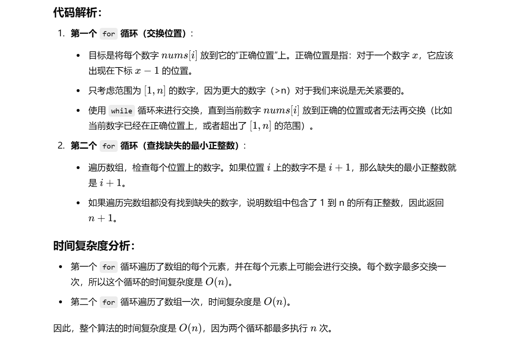

没做过这题


[41. 缺失的第一个正数 - 力扣（LeetCode）](https://leetcode.cn/problems/first-missing-positive/description/?envType=study-plan-v2&envId=top-100-liked)


知识点：


题解：[41. 缺失的第一个正数 - 力扣（LeetCode）](https://leetcode.cn/problems/first-missing-positive/solutions/304743/que-shi-de-di-yi-ge-zheng-shu-by-leetcode-solution/?envType=study-plan-v2&envId=top-100-liked)中的**方法2**


```java
class Solution {
    public int firstMissingPositive(int[] nums) {
        int n = nums.length; // 获取数组的长度

        // 第一个循环：尝试将每个数字放到正确的位置
        for (int i = 0; i < n; i++) {
            // 当 nums[i] > 0 且 nums[i] <= n 时，说明该数字是我们关心的范围内的有效正整数
            // 并且如果当前 nums[i] 不在正确的位置，即 nums[i] != nums[nums[i] - 1]，则需要交换
            while (nums[i] > 0 && nums[i] <= n && nums[i] != nums[nums[i] - 1]) {
                // 交换 nums[i] 和 nums[nums[i] - 1] 的值，尝试将 nums[i] 放到正确的位置
                int temp = nums[nums[i] - 1];
                nums[nums[i] - 1] = nums[i];
                nums[i] = temp;
            }
        }

        // 第二个循环：检查哪个位置的数字不对，返回第一个不对的索引 + 1，即为缺失的最小正整数
        for (int i = 0; i < n; i++) {
            // 如果 nums[i] 不是 i + 1，说明最小的缺失正整数就是 i + 1
            if (nums[i] != i + 1) {
                return i + 1;
            }
        }

        // 如果所有位置都正确，则数组中包含了 1 到 n 的所有正整数，返回 n + 1
        return n + 1;
    }
}

```





