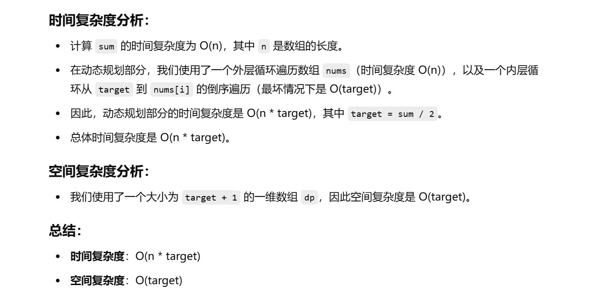

做过


[416. 分割等和子集 - 力扣（LeetCode）](https://leetcode.cn/problems/partition-equal-subset-sum/?envType=study-plan-v2&envId=top-100-liked)


知道思路，就是把数组的数求和，然后看是奇数还是偶数，如果是奇数，直接返回false

如果是偶数，那么目标和就是和的一半，按01背包的做法看能不能装满


# 写法1

```java
class Solution {
    public boolean canPartition(int[] nums) {
        // 获取数组的长度
        int n = nums.length;
        
        // 初始化数组元素和的总和
        int sum = 0;
        
        // 遍历数组，将所有元素累加到sum中
        for (int num : nums) {
            sum += num;
        }
        
        // 如果总和为奇数，则不能分割成两个和相等的子集
        if (sum % 2 == 1) {
            return false;  // 如果总和是奇数，直接返回false
        }
        
        // 目标是将一个子集的和设为总和的一半
        int target = sum / 2;
        
        // dp[i]表示是否可以通过某些元素的组合达到和为i
        int[] dp = new int[target + 1]; // 目标和从0到target
        for (int i = 0; i < n; i++) {
            // 逆序遍历，从target开始，这样可以避免重复使用当前元素
            for (int j = target; j >= nums[i]; j--) {
                // 更新dp[j]，选择最大值（即可以达到的最大和）
                dp[j] = Math.max(dp[j - nums[i]] + nums[i], dp[j]);
            }
            // 如果dp[target]达到了目标和，说明可以分割成两个子集，返回true
            if (dp[target] == target) {
                return true;
            }
        }
        
        // 如果遍历完数组后，dp[target]等于目标和，则说明可以分割
        return dp[target] == target;
    }
}

```


# 写法2


```java
class Solution {
    public boolean canPartition(int[] nums) {
        // 获取数组的长度
        int n = nums.length;
        
        // 初始化数组元素和的总和
        int sum = 0;
        
        // 遍历数组，将所有元素累加到sum中
        for (int num : nums) {
            sum += num;
        }
        
        // 如果总和为奇数，则不能分割成两个和相等的子集
        if (sum % 2 == 1) {
            return false;  // 如果总和是奇数，直接返回false
        }
        
        // 目标是将一个子集的和设为总和的一半
        int target = sum / 2;
        
        // dp[i]表示是否可以通过某些元素的组合达到和为i
        boolean[] dp = new boolean[target + 1];
        
        // 初始化dp[0]为true，表示可以通过空子集得到和为0
        dp[0] = true;
        
        // 遍历所有的元素
        for (int i = 0; i < n; i++) {
            // 逆序遍历，从target开始，确保每个元素只能使用一次
            for (int j = target; j >= nums[i]; j--) {
                // 更新dp[j]，如果dp[j - nums[i]]为true，则dp[j]也可以为true
                dp[j] = dp[j] || dp[j - nums[i]];
            }
            
            // 如果dp[target]为true，说明可以分割成两个子集，返回true
            if (dp[target]) {
                return true;
            }
        }
        
        // 如果遍历完数组后，dp[target]为true，则说明可以分割
        return dp[target];
    }
}

```





# 两种写法区别和相似处


